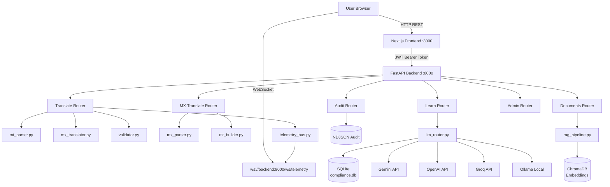
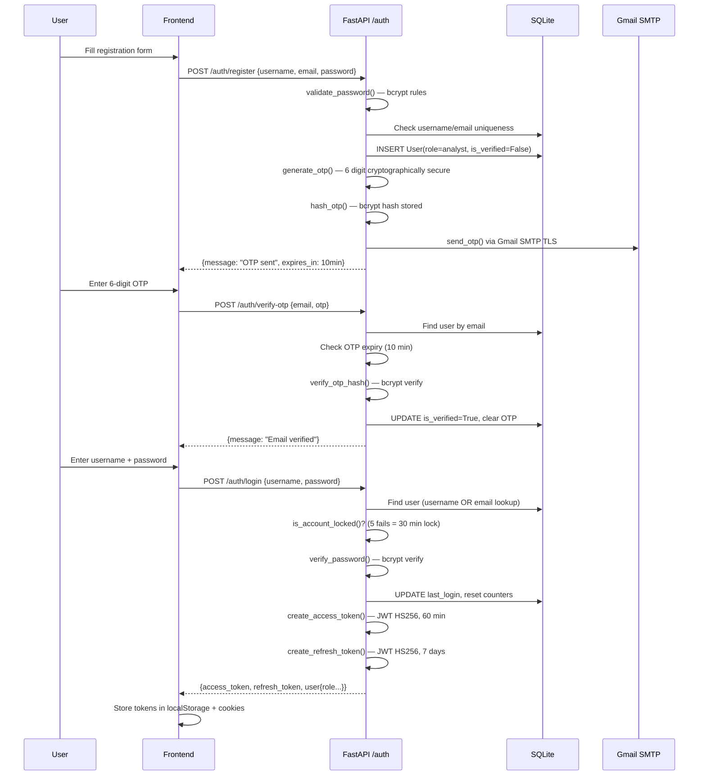

# The Compliance Leader
## Master System Architecture & Technical Reference Document

> **Document Version:** 1.0.0  
> **Codebase Branch:** Main (verified Sep 2026)  
> **Standard Compliance:** SWIFT CBPR+ R2025 (effective Nov 22, 2025)  
> **Source of Truth:** All statements verified against current repository code

---

## Table of Contents

1. [Executive Summary](#1-executive-summary)
2. [Project at a Glance](#2-project-at-a-glance)
3. [Business Problem](#3-business-problem)
4. [Non-Technical Explanation](#4-non-technical-explanation)
5. [ISO 20022 & SWIFT Domain Primer](#5-iso-20022--swift-domain-primer)
6. [Technology Stack](#6-technology-stack)
7. [System Architecture](#7-system-architecture)
8. [Authentication & Authorization](#8-authentication--authorization)
9. [Module 1 — MT → MX Translation Engine](#9-module-1--mt--mx-translation-engine)
10. [Module 2 — MX → MT Reverse Engine](#10-module-2--mx--mt-reverse-engine)
11. [Module 3 — ISO 20022 Validator](#11-module-3--iso-20022-validator)
12. [Module 4 — Domain Learning (LLM Q&A)](#12-module-4--domain-learning-llm-qa)
13. [Module 5 — Document Intelligence (RAG)](#13-module-5--document-intelligence-rag)
14. [Module 6 — Prompt Engineering Lab](#14-module-6--prompt-engineering-lab)
15. [Module 7 — Audit & Telemetry](#15-module-7--audit--telemetry)
16. [Module 8 — Admin Panel](#16-module-8--admin-panel)
17. [LLM Router Architecture](#17-llm-router-architecture)
18. [Complete API Catalog](#18-complete-api-catalog)
19. [Backend Service Deep Dive](#19-backend-service-deep-dive)
20. [Frontend Architecture](#20-frontend-architecture)
21. [Database & Storage Architecture](#21-database--storage-architecture)
22. [Security Architecture](#22-security-architecture)
23. [Threat Model](#23-threat-model)
24. [Design Patterns](#24-design-patterns)
25. [SOLID Principles Analysis](#25-solid-principles-analysis)
26. [Error Handling Scenarios](#26-error-handling-scenarios)
27. [Data Flow Diagrams](#27-data-flow-diagrams)
28. [Deployment Architecture](#28-deployment-architecture)
29. [Testing Analysis](#29-testing-analysis)
30. [Performance & Scalability](#30-performance--scalability)
31. [Current Limitations](#31-current-limitations)
32. [Future Roadmap](#32-future-roadmap)
33. [Code Quality Review](#33-code-quality-review)
34. [Architecture Scorecard](#34-architecture-scorecard)
35. [Proposed Enterprise Architecture](#35-proposed-enterprise-architecture)
36. [Requirements Traceability](#36-requirements-traceability)
37. [Complete User Journey](#37-complete-user-journey)
38. [Interview Preparation Guide](#38-interview-preparation-guide)
39. [Resume Description](#39-resume-description)
40. [Project Glossary](#40-project-glossary)

---

## 1. Executive Summary

**The Compliance Leader** is a full-stack, enterprise-grade financial compliance and payment-assistance platform built to solve the ISO 20022 migration problem facing every financial institution globally.

Since **November 22, 2025**, the SWIFT FINplus network has retired legacy MT messages (MT103, MT202, MT202COV) and mandated ISO 20022 MX messages. Banks that cannot translate their legacy payment messages face settlement failures, regulatory fines, and operational disruption.

This platform provides:
- **Deterministic, rules-based MT ↔ MX translation** compliant with CBPR+ R2025
- **AI-powered compliance education** with a multi-provider LLM layer
- **RAG document intelligence** for querying internal compliance documents
- **Tamper-evident audit logging** with SHA-256 hash chaining
- **Real-time operational telemetry** via WebSocket
- **Multi-user authentication** with banking-grade security (bcrypt, JWT, OTP, account lockout)

The system is architected as a **decoupled monolith**: a FastAPI backend (Python 3.13) and a Next.js 14 frontend (TypeScript), communicating over REST + WebSocket.

---

## 2. Project at a Glance

### One-Sentence Description
> A full-stack ISO 20022 compliance workstation that translates legacy SWIFT MT payment messages to ISO 20022 MX format, validates them against CBPR+ R2025 rules, and provides AI-powered learning, RAG document intelligence, and tamper-evident audit logging.

### Key Numbers

| Metric | Value |
|---|---|
| Supported MT → MX message types | 9 (MT103, MT103STP, MT202, MT202COV, MT204, MT205, MT205COV, MT103RETURN, MT202RETURN, MT205RETURN) |
| Backend API endpoints | 35+ REST + 1 WebSocket |
| LLM providers supported | 4 (Gemini, OpenAI, Groq, Ollama) |
| Audit hash algorithm | SHA-256 chain |
| Password hash rounds | bcrypt cost-12 |
| Document formats (RAG) | PDF, PPTX, DOCX, TXT, XML |
| Guideline versions tracked | 6 (CBPR+ R2023–R2026 Draft, ISO 20022, LYNX) |
| Prompt engineering topics | 9 |

---

## 3. Business Problem

### What Problem Exists?

The global banking industry is in the middle of the largest messaging format migration in payment history: **SWIFT MT → ISO 20022 MX**.

SWIFT MT (Message Type) is a proprietary text-based format created in the 1970s. ISO 20022 (also called MX) is an XML-based, data-rich international standard mandated by SWIFT, the EU, BIS, and Bank of England for all cross-border payments.

**The coexistence period ended November 22, 2025.** From that date:
- MT103 (customer wire transfers) → retired → replaced by pacs.008
- MT202 (bank-to-bank transfers) → retired → replaced by pacs.009 CORE
- MT202COV (cover payments) → retired → replaced by pacs.009 COV

### Who Experiences This Problem?

| Persona | Pain Point |
|---|---|
| **Payment Engineers** | Must manually translate message fields — error-prone and time-consuming |
| **Compliance Officers** | Must learn 150+ new XML elements and CBPR+ R2025 rules |
| **Operations Teams** | Settlement failures when wrong message type sent post-Nov 2025 |
| **New Employees** | No accessible way to learn ISO 20022 without expensive training |
| **QA Teams** | Validating MX XML against XSD schemas is manual and tedious |
| **Developers** | No reference implementation for CBPR+ R2025 translation rules |

### Why Is the Problem Difficult?

1. **Not a simple field rename** — MT fields map to deeply nested XML elements
2. **CBPR+ has strict business rules** beyond XSD (e.g., `ChrgBr=SHAR` only, UETR mandatory, postal address hybrid mode)
3. **Multiple message variants** (CORE vs COV, CBPR+ vs LYNX) require different handling
4. **UETR preservation** — the 36-character UUID must survive the translation chain unchanged
5. **Return payments** reference original UETRs and have 24 valid reason codes
6. **Real-time learning need** — rules change every year (R2023 → R2024 → R2025 → R2026 Draft)

### What Business Risk Does It Address?

- **Settlement failure risk** — wrong message format post-Nov 2025 causes payment rejection
- **Regulatory risk** — CBPR+ violations can trigger fines or correspondent bank blacklisting
- **Operational risk** — manual translation introduces human error in high-value wire transfers
- **Onboarding risk** — knowledge gap when payments staff unfamiliar with ISO 20022

---

## 4. Non-Technical Explanation

### Explain This Project Like I'm Not a Software Engineer

Imagine you work at a bank in an international wire transfer department. For 50 years, you've sent messages in a format called **SWIFT MT** — think of it like sending a telegram with specific codes (`:20:` for reference, `:32A:` for amount, `:57A:` for the receiving bank).

Now, **SWIFT retired that format**. Every bank must switch to a new format called **ISO 20022** — think of it like switching from telegrams to structured data forms with specific fields in specific places.

**The Compliance Leader** is like having five expert assistants on your desk:

| Assistant | Role |
|---|---|
| 📋 **The Translator** | Takes your old MT message, converts it to the new XML format in seconds, checks all the rules |
| 📖 **The Professor** | You can ask any compliance question — "What is a UETR?" — and get an instant expert answer |
| 🔍 **The Document Searcher** | Upload your bank's internal compliance manuals, ask questions, get answers citing the exact document |
| 🎓 **The Trainer** | Interactive lessons on how to write better AI prompts for financial compliance work |
| 🔒 **The Auditor** | Records every action taken, who did it, when, and creates a tamper-proof log that nobody can alter |
| ⚙️ **The Controller** | Admin tools to manage users and configure which AI model to use |

---

## 5. ISO 20022 & SWIFT Domain Primer

### What is SWIFT?

SWIFT (Society for Worldwide Interbank Financial Telecommunication) is a member-owned cooperative that provides the global messaging network used by 11,000+ banks to communicate payment instructions. SWIFT does not move money; it moves **messages that instruct banks to move money**.

### What is SWIFT MT?

MT (Message Type) is SWIFT's legacy text-based messaging format. Key characteristics:
- Block-delimited: `{1:F01BANKGB2LAXXX}{4: :20:TXREF :32A:260523USD10000,00 -}`
- Field-tagged with colon codes: `:20:` = transaction reference, `:32A:` = value date/currency/amount
- Created in the 1970s, lacks structure for modern data requirements (no LEI, no UETR natively)

### What is ISO 20022?

ISO 20022 is an international standard for financial messaging using XML. It provides:
- **Rich structured data** — Named fields, not codes
- **Mandatory unique identifiers** — UETR (UUID4) for every transaction
- **Detailed party information** — BIC, LEI, IBAN, postal address components

### What is CBPR+?

Cross-Border Payments and Reporting Plus (CBPR+) is SWIFT's implementation rulebook for ISO 20022 cross-border payments. It defines **which fields are mandatory, which codes are permitted, and how rules evolve each year** (R2023, R2024, R2025, R2026 Draft).

**CBPR+ R2025 Key Rules (enforced in this platform):**
1. UETR (UUID4) mandatory in `<PmtId><UETR>` in all pacs messages
2. `ChrgBr = SHAR` only — DEBT and CRED not valid in interbank pacs.008
3. PostalAddress hybrid mode: `<TwnNm>` and `<Ctry>` mandatory
4. pacs.009 CORE must NOT contain retail customer fields
5. pacs.009 COV must include `<UndrlygCstmrCdtTrf>` block
6. pacs.004 must reference original UETR and use valid reason codes (24 codes defined)

### Message Type Mapping Table

| MT Format | ISO 20022 Target | Description | Network |
|---|---|---|---|
| MT103 | pacs.008.001.08 | Customer Credit Transfer | CBPR+ |
| MT103STP | pacs.008.001.08 | Straight-Through Processing variant | CBPR+ |
| MT202 | pacs.009.001.08 (CORE) | FI-to-FI Credit Transfer | CBPR+ |
| MT202COV | pacs.009.001.08 (COV) | Cover Payment | CBPR+ |
| MT204 | pacs.009.001.08 (ADV) | FI Debit Advice | CBPR+ |
| MT103RETURN | pacs.004.001.09 | Payment Return | CBPR+ |
| MT202RETURN | pacs.004.001.09 | Bank Transfer Return | CBPR+ |
| MT205 | pacs.009.001.08 (CORE) | Canadian Domestic FI Transfer | LYNX |
| MT205COV | pacs.009.001.08 (COV) | Canadian Domestic Cover | LYNX |
| MT205RETURN | pacs.004.001.09 | Canadian Domestic Return | LYNX |

### What is a UETR?

The **Unique End-to-end Transaction Reference** is a UUID4 identifier (e.g., `f9e4a3b2-1c5d-4e7f-8a9b-0d1e2f3a4b5c`) mandated by SWIFT gpi. It:
- Appears in MT messages in block 3 field `{121:}`
- Appears in MX messages in `<PmtId><UETR>`
- **Must be preserved unchanged** across the entire payment chain
- Enables tracking via the SWIFT gpi Tracker
- Is validated as UUID4 format (version-4 bit pattern enforced)

### What is a Cover Payment?

When Bank A sends a customer wire to Bank C but has no direct relationship:
1. Bank A sends a **pacs.008** (customer credit transfer) directly to Bank C
2. Bank A sends a **pacs.009 COV** (cover payment) to Bank B (its correspondent) instructing it to fund Bank C

The cover payment `<UndrlygCstmrCdtTrf>` block links the two messages. Under CBPR+, the cover leg gets a **new UETR**; under LYNX (Canada), the same UETR is propagated.

### What is LYNX?

LYNX is the Bank of Canada's large-value payment system (replaced LVTS in 2021). It uses ISO 20022 with its own variant rules, particularly around MT205 (domestic equivalent of MT202) and UETR propagation in cover payments.

---

## 6. Technology Stack

*Verified from `requirements.txt`, `package.json`, source code, and `docker-compose.yml`.*

### Backend Stack

| Layer | Technology | Version | Purpose | Evidence |
|---|---|---|---|---|
| Language | Python | 3.13 | Runtime | `requirements.txt` comment |
| Web Framework | FastAPI | 0.115.5 | REST API + WebSocket | `requirements.txt` |
| ASGI Server | Uvicorn | 0.32.1 | Production async server | `requirements.txt` |
| Data Validation | Pydantic v2 | 2.10.3 | Request/response schemas | `requirements.txt` |
| Config Management | pydantic-settings | 2.7.0 | Environment variable loading | `config.py` |
| ORM | SQLAlchemy | 2.0.36 | Database access | `requirements.txt` |
| Database Driver | aiosqlite | 0.20.0 | Async SQLite access | `requirements.txt` |
| Database | SQLite | Built-in | User data, guidelines | `config.py` L33 |
| XML Processing | lxml | 5.3.0 | ISO 20022 XML generation | `mx_translator.py` |
| XML Validation | xmlschema | 3.4.2 | XSD schema validation | `requirements.txt` |
| Auth - JWT | python-jose | 3.3.0 | JWT encode/decode | `requirements.txt` |
| Auth - Hashing | passlib + bcrypt | 1.7.4 + 4.2.1 | bcrypt cost-12 password hashing | `auth_service.py` |
| Logging | structlog | 24.4.0 | Structured JSON logging | `main.py` |
| Async Files | aiofiles | 24.1.0 | Async NDJSON audit writes | `audit_logger.py` |
| HTTP Client | httpx | 0.28.0 | LLM provider API calls | `llm_router.py` |
| LLM - Gemini | google-generativeai | ≥0.8.3 | Gemini AI calls | `requirements.txt` |
| LLM - OpenAI | openai | ≥1.57.2 | GPT-4o calls | `requirements.txt` |
| LLM Framework | LangChain | ≥0.3.12 | Document chunking | `requirements.txt` |
| Vector Database | ChromaDB | ≥0.6.0 | Embedding storage | `rag_pipeline.py` |
| Embeddings | sentence-transformers | ≥3.3.1 | Local embedding generation | `rag_pipeline.py` |
| Embedding Model | all-MiniLM-L6-v2 | - | 384-dim embeddings | `rag_pipeline.py` L31 |
| ML Framework | PyTorch | ≥2.6.0 | Required by sentence-transformers | `requirements.txt` |
| PDF Parsing | PyMuPDF (fitz) | 1.25.1 | PDF text extraction | `rag_pipeline.py` |
| PPTX Parsing | python-pptx | 1.0.2 | PowerPoint extraction | `rag_pipeline.py` |
| DOCX Parsing | python-docx | 1.1.2 | Word document extraction | `rag_pipeline.py` |
| Testing | pytest + pytest-asyncio | 8.3.4 | Async test framework | `requirements.txt` |

### Frontend Stack

| Layer | Technology | Version | Purpose | Evidence |
|---|---|---|---|---|
| Framework | Next.js | 14 (App Router) | SSR + CSR React framework | `package.json` |
| Language | TypeScript | 5.x | Type safety | `tsconfig.json` |
| Styling | Vanilla CSS + CSS variables | - | Design system | `globals.css` |
| Fonts | Google Fonts (Inter + JetBrains Mono) | - | Typography | `globals.css` |
| Auth Guard | Next.js Middleware | - | Server-side route protection | `middleware.ts` |
| HTTP Client | `fetch` API | Native | REST API calls | All pages |
| WebSocket | Browser native WebSocket | - | Real-time telemetry | `TelemetryFeed.tsx` |
| State | React useState / useEffect | - | Local component state | All pages |
| Routing | Next.js App Router | - | File-based routing | `app/` directory |

### Infrastructure

| Component | Technology | Purpose | Evidence |
|---|---|---|---|
| Container | Docker | Backend + Frontend isolation | `Dockerfile` (both) |
| Orchestration | Docker Compose v3.9 | Multi-service coordination | `docker-compose.yml` |
| Network | Bridge network `compliance_net` | Container-to-container comms | `docker-compose.yml` |
| Health Check | `curl /health` every 30s | Container health monitoring | `docker-compose.yml` |
| Volume | `./data:/app/data` | Persistent storage | `docker-compose.yml` |

---

## 7. System Architecture

### High-Level Architecture Diagram

```
┌─────────────────────────────────────────────────────────────────────┐
│                        USER (Browser)                                │
│              http://localhost:3000                                    │
└───────────────────────────┬─────────────────────────────────────────┘
                            │ HTTP/HTTPS + WebSocket
┌───────────────────────────▼─────────────────────────────────────────┐
│                  FRONTEND — Next.js 14 (TypeScript)                  │
│  ┌──────────┐ ┌──────────┐ ┌──────────┐ ┌──────────┐ ┌──────────┐ │
│  │  /login  │ │/translate│ │  /learn  │ │/documents│ │  /admin  │ │
│  └──────────┘ └──────────┘ └──────────┘ └──────────┘ └──────────┘ │
│  ┌──────────────────────────────────────────────────────────────┐   │
│  │  Middleware (auth guard: JWT cookie check, admin role check) │   │
│  └──────────────────────────────────────────────────────────────┘   │
└───────────────────────────┬─────────────────────────────────────────┘
                            │ REST API calls to :8000
                            │ WebSocket: ws://localhost:8000/ws/telemetry
┌───────────────────────────▼─────────────────────────────────────────┐
│              BACKEND — FastAPI (Python 3.13, Uvicorn)                │
│                   http://localhost:8000                               │
│                                                                       │
│  Router Layer: /auth /translate /mx-translate /validate /learn       │
│               /documents /audit /prompts /llm-config /admin          │
│                                                                       │
│  Service Layer: auth_service  mt_parser  mx_translator  mx_parser    │
│                 mt_builder  validator  llm_router  llm_config_store   │
│                 rag_pipeline  audit_logger  telemetry_bus             │
│                 email_service  guideline_registry                     │
│                                                                       │
│  Storage Layer: SQLite (users, guidelines)  ChromaDB (embeddings)    │
│                 NDJSON files (audit log)    File system (uploads/XSD) │
└───────────────────────────┬─────────────────────────────────────────┘
                            │
┌───────────────────────────▼─────────────────────────────────────────┐
│                    EXTERNAL SERVICES                                  │
│  Google Gemini API | OpenAI GPT-4o | Groq Llama 3.x | Ollama (local)│
│  Gmail SMTP (OTP delivery)                                           │
└─────────────────────────────────────────────────────────────────────┘
```

### Component Interaction (Mermaid)



---

## 8. Authentication & Authorization

### Complete Auth Flow



### Password Policy (from `auth_service.py`)

| Rule | Value |
|---|---|
| Minimum length | 8 characters |
| Uppercase required | Yes |
| Lowercase required | Yes |
| Digit required | Yes |
| Special character required | Yes (`!@#$%^&*()_+-=[]{}|;:,.<>?`) |

### JWT Token Structure

| Token | Algorithm | Expiry | Claims |
|---|---|---|---|
| Access Token | HS256 | 60 minutes | `sub`, `username`, `role`, `type=access`, `exp` |
| Refresh Token | HS256 | 7 days | `sub`, `type=refresh`, `exp` |

### Security Controls

| Control | Implementation |
|---|---|
| Password hashing | bcrypt cost-12 |
| OTP hashing | bcrypt (never plaintext) |
| OTP rate limit | 5 attempts, 3 resends max |
| Login lockout | 5 fails → 30 min lock |
| Route protection | `middleware.ts` + `ConditionalLayout.tsx` (2 layers) |
| Admin routes | `require_admin()` dependency + `user_role` cookie |
| User enumeration | Resend OTP returns same message regardless of existence |

### Role System

| Role | Access | Assignment |
|---|---|---|
| `analyst` | All features except Admin | Default on registration |
| `admin` | All features + Admin panel | Seeded on startup; promotable via Admin |

> **Evidence:** `auth_service.py` L140, `middleware.ts` L40-44

---

## 9. Module 1 — MT → MX Translation Engine

### Translation Pipeline

```
MT Raw String
    │
    ▼
[mt_parser.py] — Block parsing, field extraction
    │ → Blocks 1-5 parsed; UETR from block 3 {121:}
    ▼
[mx_translator.py] — CBPR+ pre-validation, field mapping
    │ → Validates ChrgBr, UETR, PostalAddress before building
    ▼
[lxml] — XML tree construction with ISO 20022 namespaces
    │ → Generates namespace-correct pacs.008/pacs.009/pacs.004 XML
    ▼
[validator.py] — XSD validation + CBPR+ business rule checks
    │ → XSD file (optional) + 8 CBPR+ rule checks
    ▼
ISO 20022 XML + Validation Report
    │
    ▼
[audit_logger.py] → [telemetry_bus.py]
```

### MT Field Mapping Table (MT103 → pacs.008)

| MT Field | Tag | Semantic Name | MX Element |
|---|---|---|---|
| `:20:` | Transaction Reference | `transaction_ref` | `<InstrId>` / `<MsgId>` |
| `:32A:` | Value Date/Currency/Amount | `value_date`, `currency`, `amount` | `<IntrBkSttlmDt>`, `<IntrBkSttlmAmt Ccy="">` |
| `:50K:` | Ordering Customer | `ordering_customer` | `<Dbtr><Nm>` + `<DbtrAcct><Id><IBAN>` |
| `:52A:` | Ordering Institution | `ordering_institution` | `<DbtrAgt><FinInstnId><BICFI>` |
| `:53B:` | Sender's Correspondent | `senders_correspondent` | `<PrvsInstgAgt>` |
| `:54A:` | Receiver's Correspondent | `receivers_correspondent` | `<IntrmyAgt1>` |
| `:57A:` | Account With Institution | `account_with_institution` | `<CdtrAgt><FinInstnId><BICFI>` |
| `:59:` | Beneficiary | `beneficiary` | `<Cdtr><Nm>` + `<CdtrAcct><Id><IBAN>` |
| `:70:` | Remittance Info | `remittance_info` | `<RmtInf><Ustrd>` |
| `:71A:` | Details of Charges | `details_of_charges` | Mapped to `ChrgBr` → always `SHAR` |

### CBPR+ ChrgBr Mapping

```python
# from mx_translator.py L94-98
SHA → SHAR  (correct code)
OUR → SHAR  (DEBT invalid in CBPR+ interbank — mapped per R2025)
BEN → SHAR  (CRED invalid in CBPR+ interbank — mapped per R2025)
```

### Translation Modes

| Mode | Behavior | HTTP Response |
|---|---|---|
| **Partial** (default, `force_output=False`) | Stops at first CBPR+ violation | HTTP 422 `SWIFT_ISO_MUTATION_DENIED` |
| **Full** (`force_output=True`) | Records CBPR+ warning, continues building XML | `status: PARTIAL`, warnings in `validation_errors` |

### ISO 20022 Namespaces

```python
NS_PACS008 = "urn:iso:std:iso:20022:tech:xsd:pacs.008.001.08"
NS_PACS009 = "urn:iso:std:iso:20022:tech:xsd:pacs.009.001.08"
NS_PACS004 = "urn:iso:std:iso:20022:tech:xsd:pacs.004.001.09"
NS_HEAD001 = "urn:iso:std:iso:20022:tech:xsd:head.001.001.02"
```

### UETR Handling

1. If block 3 `{121:}` present → extract and validate UUID4 format
2. Valid UUID4 → preserve in `<PmtId><UETR>`
3. Absent or invalid → generate new `str(uuid.uuid4())`

### CBPR+ Return Reason Codes (24 codes, R2025)

`AM09, AGNT, CUST, DUPL, UPAY, NARR, FOCR, FF01, AC04, AC06, BE04, MD01, MD07, MS02, MS03, RC01, RR01, RR02, RR03, RR04, SL01, ARDT, CNOR, CNPC, CURR`

---

## 10. Module 2 — MX → MT Reverse Engine

### Pipeline

```
ISO 20022 XML String
    │
    ▼
[mx_parser.py] — Namespace detection, field extraction
    │
    ▼
[auto_detect_target_mt()] — Determine MT type from fields
    │
    ▼
[mt_builder.py] — Construct SWIFT MT with proper block delimiters
    │
    ▼
Raw SWIFT MT String
```

### Scheme-Aware Translation

| Source Type | Scheme | Target MT |
|---|---|---|
| pacs.008.001.08 | CBPR+ | MT103 |
| pacs.009.001.08 CORE | CBPR+ | MT202 |
| pacs.009.001.08 COV | CBPR+ | MT202COV |
| pacs.004.001.09 | CBPR+ | MT103RETURN / MT202RETURN (auto-detected from `<OrgnlMsgNmId>`) |
| pacs.009.001.08 CORE | LYNX | MT205 |
| pacs.009.001.08 COV | LYNX | MT205COV |
| pacs.004.001.09 | LYNX | MT205RETURN |

### Cover Payment Conversion

**CBPR+:** Cover leg gets a **new UUID4 UETR**. Original pacs.008 UETR preserved in `<UndrlygCstmrCdtTrf>`.

**LYNX:** Cover leg carries the **same UETR** from the underlying pacs.008 (Canadian direct reconciliation requirement).

> **Evidence:** `mx_translate.py` L322-328

---

## 11. Module 3 — ISO 20022 Validator

### Validation Pipeline

```
XML String → lxml parse → XSD validation (if .xsd present) → CBPR+ rules
```

### CBPR+ R2025 Rules Checked

| Rule | Message Type | Check |
|---|---|---|
| UETR mandatory + UUID4 format | pacs.008, pacs.009, pacs.004 | XPath + UUID4 regex |
| `ChrgBr = SHAR` | pacs.008 | XPath value comparison |
| `<TwnNm>` mandatory | All | XPath in PstlAdr |
| `<Ctry>` mandatory + 2-letter ISO | All | XPath + country regex |
| No retail fields in CORE | pacs.009 CORE | Absence check |
| `<UndrlygCstmrCdtTrf>` present | pacs.009 COV | Presence check |
| `<OrgnlUETR>` + `<OrgnlMsgId>` | pacs.004 | XPath check |
| `<RtrRsnInf><Rsn><Cd>` valid code | pacs.004 | Against 24-code list |

---

## 12. Module 4 — Domain Learning (LLM Q&A)

### Architecture

```
User Query → [learn.py] → [rag_pipeline.query_documents()] (optional context)
    → [llm_router.query()] → Gemini/OpenAI/Groq/Ollama → LLM Response
    → [audit_logger.log(LEARN_QUERY)] → [telemetry_bus.broadcast()]
```

### Financial Domain System Prompt (from `llm_router.py`)

The hardcoded system prompt enforces compliance-grade responses:
- "Current authoritative standard is SWIFT CBPR+ R2025"
- "MT103/MT202/MT202COV are retired from SWIFT FINplus"
- All 5 CBPR+ R2025 mandatory rules specified
- "Always reference exact XML element path"
- "Distinguish MT vs MX clearly"
- Version-aware when guideline context selected

### Learning Topics (8 topics from `learn.py`)

| Topic ID | Title |
|---|---|
| pacs008 | pacs.008 FI-to-FI Customer Credit Transfer |
| pacs009_core | pacs.009 CORE Variant |
| pacs009_cov | pacs.009 COV Variant |
| pacs009_adv | pacs.009 ADV Variant |
| pacs004 | pacs.004 Payment Return |
| uetr | UETR — Unique End-to-End Transaction Reference |
| cbpr_plus | CBPR+ Cross-Border Payments and Reporting Plus |
| lynx | LYNX — Large Value Transfer System (Canada) |

### Mock Fallback

If no API key configured, keyword-matching returns domain-relevant snippets (pacs.008, pacs.009, pacs.004, uetr, nostro). User prompted to configure key via LLM Config panel.

---

## 13. Module 5 — Document Intelligence (RAG)

### Why RAG?

| Approach | Problem |
|---|---|
| LLM only | Training cutoff; no knowledge of your internal compliance docs |
| RAG | Retrieve relevant document chunks → grounded, source-cited answers |

### RAG Pipeline (from `rag_pipeline.py`)

**Ingestion:**
```
Upload → Text Extraction (PyMuPDF/pptx/docx) → Chunking (512 words, 64 overlap)
    → Embedding (all-MiniLM-L6-v2, 384-dim, local) → ChromaDB (cosine similarity)
```

**Query:**
```
Question → Embed → ChromaDB cosine search (top-3 chunks)
    → Prompt: "Context:\n{chunks}\n\nQuestion:\n{question}" → LLM → Grounded Answer
```

### Key Design Decisions

| Decision | Rationale |
|---|---|
| Local embedding (`all-MiniLM-L6-v2`) | Sensitive docs never leave server for embedding |
| ChromaDB (file-based) | Zero-infrastructure; no external service required |
| Chunk: 512 words, overlap: 64 | Balances context richness; overlap prevents boundary loss |
| PyMuPDF over PyPDF2 | Better text quality for complex financial PDFs |
| Lazy singleton init | 500MB torch model loaded only on first document operation |

### Supported File Types

`.pdf`, `.pptx`, `.docx`, `.txt`, `.xml`

---

## 14. Module 6 — Prompt Engineering Lab

### 9 Topics (from `prompt_engineering.py`)

| # | Topic | Technique |
|---|---|---|
| 1 | intro | What Is Prompt Engineering? |
| 2 | zero_shot | Zero-Shot Prompting |
| 3 | few_shot | Few-Shot Prompting |
| 4 | chain_of_thought | Chain-of-Thought Reasoning |
| 5 | role_prompting | Role Prompting (Persona) |
| 6 | structured_output | Structured Output |
| 7 | constraints | Constraint-Based Prompting |
| 8 | iterative | Iterative Refinement |
| 9 | domain_specific | Domain-Specific Financial Prompting |

All examples are grounded in ISO 20022 / CBPR+ financial domain context.

**Live Try:** Users write prompts and submit to the active LLM provider. Every execution audited.

---

## 15. Module 7 — Audit & Telemetry

### SHA-256 Hash Chain Mechanism

```
Entry 1: hash1 = SHA256("" + JSON(Entry1))
Entry 2: hash2 = SHA256(hash1 + JSON(Entry2))
Entry 3: hash3 = SHA256(hash2 + JSON(Entry3))
```

If Entry 2 is tampered: recomputed hash ≠ recorded hash3 → **Tampering detected**.

### Audit Entry Schema

```json
{
  "audit_id": "uuid4",
  "timestamp": "ISO-8601 UTC",
  "event_type": "TRANSLATION | USER_LOGIN | ...",
  "module": "translate | auth | learn | ...",
  "status": "SUCCESS | ERROR | WARN | PARTIAL",
  "uetr": "uuid4 or null",
  "message_type": "pacs.008.001.08 or null",
  "details": { "...event-specific data..." },
  "hash": "sha256 hex string"
}
```

### PII Masking (Applied Before Write)

| Pattern | Regex | Replacement |
|---|---|---|
| IBAN | `\b[A-Z]{2}[0-9]{2}[A-Z0-9]{4,}\b` | `[MASKED]` |
| Account numbers | `\b\d{8,}\b` | `[MASKED]` |

### Audit Event Types

`SYSTEM_STARTUP, USER_REGISTERED, EMAIL_VERIFIED, USER_LOGIN, USER_LOGOUT, PASSWORD_CHANGED, ACCOUNT_LOCKED, TRANSLATION, VALIDATION, MX_TRANSLATION, MX_COVER_CONVERSION, LEARN_QUERY, DOCUMENT_UPLOADED, DOCUMENT_QUERY, PROMPT_TRY`

### Storage

Daily rotating NDJSON: `./data/audit/compliance_audit_YYYY-MM-DD.ndjson`

Opened in append mode per write — no read-modify-write risk. asyncio `Lock` prevents concurrent write races.

### WebSocket Telemetry

**Endpoint:** `ws://localhost:8000/ws/telemetry`

Event format:
```json
{
  "event_id": "uuid4",
  "timestamp": "ISO-8601",
  "event_type": "TRANSLATION_COMPLETE",
  "module": 1,
  "severity": "INFO | WARN | ERROR",
  "summary": "MT103 → pacs.008 translation succeeded",
  "data": {"audit_id": "...", "uetr": "...", "validation_errors": 0}
}
```

`TelemetryBus` maintains `Set[WebSocket]`. Dead clients removed on failed send.

---

## 16. Module 8 — Admin Panel

### Capabilities (from `admin.py`, auth-gated by `require_admin()`)

| Capability | Endpoint |
|---|---|
| List all users | `GET /api/v1/admin/users` |
| Create user (bypasses OTP) | `POST /api/v1/admin/users` |
| Promote/demote role | `PUT /api/v1/admin/users/{id}/role` |
| Lock/unlock account | `PUT /api/v1/admin/users/{id}/lock` |
| Force password reset | `POST /api/v1/admin/users/{id}/force-reset` |
| Manual email verify | `POST /api/v1/admin/users/{id}/verify` |
| Hard delete | `DELETE /api/v1/admin/users/{id}` |
| Platform statistics | `GET /api/v1/admin/stats` |
| System information | `GET /api/v1/admin/system` |

### LLM Configuration (Runtime, No Restart)

Via `/api/v1/llm-config`: Switch provider, update API key, select model, configure Ollama URL, view last-25 config change history.

### Guideline Version Management

Pre-seeded versions: CBPR+ R2023, R2024, R2025, R2026 Draft, ISO 20022 Unscheduled, LYNX 2024.

---

## 17. LLM Router Architecture

### Provider Routing Strategy

```
llm_router.query(message, context, version_context)
    → Read from llm_config_store (runtime, no restart needed)
    ├── provider == "gemini" → _query_gemini() — Gemini REST v1beta
    ├── provider == "openai" → _query_openai() — OpenAI chat completions
    ├── provider == "groq"   → _query_groq() — Groq OpenAI-compatible API
    ├── provider == "ollama" → _query_ollama() — local REST
    └── no API key           → _mock_response() — domain-relevant fallback
```

### Provider Endpoints

| Provider | API Base URL | Auth |
|---|---|---|
| Gemini | `https://generativelanguage.googleapis.com/v1beta` | `?key=API_KEY` |
| OpenAI | `https://api.openai.com/v1/chat/completions` | `Authorization: Bearer TOKEN` |
| Groq | `https://api.groq.com/openai/v1/chat/completions` | `Authorization: Bearer TOKEN` |
| Ollama | `http://localhost:11434/api/generate` | None (local) |

### Active Models (Verified Sep 2026)

**Gemini:** `gemini-2.0-flash` (default), `gemini-2.5-flash`, `gemini-3.5-flash`, `gemini-3.8-flash`, `gemini-3.5-flash-lite`

**Groq (active):** `llama-3.3-70b-versatile` ✅, `llama-3.1-8b-instant` ✅, `meta-llama/llama-4-scout-17b-16e-instruct` ✅, `gemma2-9b-it` ✅
**Groq (decommissioned):** `llama3-70b-8192` ❌, `llama3-8b-8192` ❌, `mixtral-8x7b-32768` ❌

**OpenAI:** `gpt-4o`, `gpt-4o-mini`, `gpt-4-turbo`, `gpt-3.5-turbo`

**Ollama:** `llama3`, `llama3.1`, `llama3:70b`, `mistral`, `codellama`

### Retry Logic

3 attempts, exponential backoff: 1s → 2s → 4s.

---

## 18. Complete API Catalog

*Base: `http://localhost:8000/api/v1` | Interactive docs: `/api/docs`*

### Authentication

| Method | Endpoint | Auth | Purpose |
|---|---|---|---|
| POST | `/auth/register` | None | Register, send OTP |
| POST | `/auth/verify-otp` | None | Verify OTP, activate |
| POST | `/auth/resend-otp` | None | Resend OTP (max 3) |
| POST | `/auth/login` | None | Login → JWT tokens |
| POST | `/auth/refresh` | Refresh Token | New access token |
| POST | `/auth/logout` | Bearer | Logout + audit |
| GET | `/auth/me` | Bearer | Current user profile |
| POST | `/auth/change-password` | Bearer | Change password |

### Translation

| Method | Endpoint | Auth | Purpose |
|---|---|---|---|
| POST | `/translate` | None | MT → MX (CBPR+ R2025) |
| POST | `/validate` | None | ISO 20022 XML validation |
| GET | `/translate/sample/{type}` | None | Sample MT strings |
| POST | `/mx-translate` | None | MX → MT reverse |
| POST | `/mx-translate/cover` | None | pacs.008 → pacs.009COV |
| GET | `/mx-translate/sample/{type}/{scheme}` | None | Sample MX XML |

### Learning & Documents

| Method | Endpoint | Auth | Purpose |
|---|---|---|---|
| POST | `/learn` | Bearer | LLM domain query |
| GET | `/learn/topics` | Bearer | Topic list |
| POST | `/documents/upload` | Bearer | Upload + RAG index |
| POST | `/documents/query` | Bearer | RAG Q&A |
| GET | `/documents/list` | Bearer | List documents |
| GET | `/prompts/topics` | None | Prompt Lab topics |
| GET | `/prompts/examples/{id}` | None | Topic examples |
| POST | `/prompts/try` | None | Live LLM prompt |

### Audit & Config

| Method | Endpoint | Auth | Purpose |
|---|---|---|---|
| GET | `/audit/logs` | Bearer | Paginated logs |
| GET | `/audit/export` | Bearer | NDJSON bundle download |
| WS | `ws://.../ws/telemetry` | None | Real-time stream |
| GET | `/llm-config` | Bearer | Current config |
| POST | `/llm-config` | Bearer | Update provider/model |
| GET | `/llm-config/history` | Bearer | Last 25 changes |
| GET | `/llm-config/models` | Bearer | All provider models |
| GET | `/guidelines/versions` | Bearer | Guideline versions |

### Admin (all require admin role)

| Method | Endpoint | Purpose |
|---|---|---|
| GET | `/admin/users` | List all users |
| POST | `/admin/users` | Create user |
| GET | `/admin/users/{id}` | User detail |
| PUT | `/admin/users/{id}/role` | Promote/demote |
| PUT | `/admin/users/{id}/lock` | Lock/unlock |
| PUT | `/admin/users/{id}/activate` | Activate/deactivate |
| POST | `/admin/users/{id}/force-reset` | Force reset |
| POST | `/admin/users/{id}/verify` | Manual verify |
| DELETE | `/admin/users/{id}` | Hard delete |
| GET | `/admin/stats` | Platform stats |
| GET | `/admin/system` | System info |
| GET | `/health` | Full health check |

---

## 19. Backend Service Deep Dive

### `auth_service.py` — Key Functions

| Function | Purpose | Returns |
|---|---|---|
| `hash_password(password)` | bcrypt cost-12 | `str` |
| `verify_password(plain, hashed)` | bcrypt verify | `bool` |
| `validate_password(password)` | Policy (5 rules) | `list[str]` violations |
| `generate_otp()` | Cryptographically secure 6-digit | `str` |
| `hash_otp(otp)` | bcrypt hash OTP | `str` |
| `create_access_token(user_id, username, role)` | HS256 JWT, 60 min | `str` |
| `create_refresh_token(user_id)` | HS256 JWT, 7 days | `str` |
| `decode_token(token)` | Validate + decode JWT | `dict` |
| `is_account_locked(user)` | Lockout check | `bool` |
| `get_current_user()` | FastAPI dependency | `User` |
| `require_admin()` | FastAPI dependency | `User` or 403 |
| `init_db()` | Create tables, seed admin | `None` |

### `audit_logger.py` — Design Notes

Singleton with asyncio `Lock`. On startup, reads last hash from today's NDJSON to continue chain correctly after restart. Opens file in `"a"` mode per write.

### `rag_pipeline.py` — Design Notes

Embedding model (`all-MiniLM-L6-v2`) loaded lazily — heavy (500MB PyTorch). ChromaDB collection `"compliance_docs"` with cosine similarity. Chunk algorithm: sliding word window.

### `telemetry_bus.py` — Design Notes

`Set[WebSocket]` — fire-and-forget broadcast. Dead clients detected by `WebSocketState.CONNECTED` check, silently discarded.

### `llm_config_store.py` — Design Notes

In-memory only. Changes instant, lost on restart. Rolling `deque(maxlen=25)` history. API keys masked in history (first 8 + `*` + last 4) but full key in memory.

---

## 20. Frontend Architecture

### Page Structure

| Page | Path | API Calls | WebSocket |
|---|---|---|---|
| Dashboard | `/` | `GET /health` | `/ws/telemetry` |
| Login | `/login` | `POST /auth/login` | No |
| Register | `/register` | `POST /auth/register` | No |
| OTP | `/verify-otp` | `POST /auth/verify-otp` | No |
| MT → MX | `/translate` | `POST /translate`, `POST /validate` | No |
| MX → MT | `/mx-translate` | `POST /mx-translate`, `POST /mx-translate/cover` | No |
| Learn | `/learn` | `POST /learn`, `GET /learn/topics` | No |
| Documents | `/documents` | `POST /documents/upload`, `POST /documents/query` | No |
| Audit | `/audit` | `GET /audit/logs`, `GET /audit/export` | No |
| Prompt Lab | `/prompt-engineering` | `GET /prompts/topics`, `POST /prompts/try` | No |
| Admin | `/admin` | All `/admin/*` + `/llm-config` | No |

### Key Components

| Component | Responsibility |
|---|---|
| `Sidebar.tsx` | Navigation with all 8 modules |
| `TopBar.tsx` | User info + LLM config toggle |
| `ConditionalLayout.tsx` | Client-side auth guard |
| `TelemetryFeed.tsx` | WebSocket real-time event feed |
| `AuditTable.tsx` | Paginated filterable audit table |
| `DocumentUploader.tsx` | File upload + RAG query UI |
| `GuidelineSelector.tsx` | CBPR+ version picker for LLM context |
| `LLMConfigPanel.tsx` | Runtime provider/model/key configuration |
| `ValidationBadge.tsx` | XSD + CBPR+ validation result display |

### Two-Layer Auth Guard

| Layer | File | Mechanism |
|---|---|---|
| Server-side | `middleware.ts` | Checks `access_token` cookie, redirects if absent |
| Client-side | `ConditionalLayout.tsx` | useEffect checks localStorage, redirects if missing |

Two layers prevent "auth flash" — content briefly visible before auth state resolves.

### Design System (from `globals.css`)

- Dark mode: `--bg: #080C14`
- Accent: `--primary: #00D4FF` (cyan)
- Success: `--success: #00E5A0`
- Warning: `--warning: #FFB800`
- Typography: Inter (UI) + JetBrains Mono (code)
- Effects: glassmorphism (backdrop-filter blur), keyframe animations

---

## 21. Database & Storage Architecture

### Storage Layout

```
./data/
├── compliance.db           ← SQLite — users, guideline_versions
├── audit/
│   ├── compliance_audit_2026-09-20.ndjson
│   └── compliance_audit_YYYY-MM-DD.ndjson
├── chroma/                 ← ChromaDB vector store
│   └── {collection-uuid}/
├── uploads/                ← Raw uploaded documents
│   └── {uuid}_filename.pdf
└── xsd/                    ← ISO 20022 XSD schemas (optional)
    └── pacs.008.001.08.xsd
```

### SQLite `users` Table (Schema from `auth_service.py`)

```sql
id TEXT PRIMARY KEY,
username TEXT UNIQUE NOT NULL,
email TEXT UNIQUE NOT NULL,
full_name TEXT,
hashed_password TEXT NOT NULL,
role TEXT DEFAULT 'analyst',
is_active BOOLEAN DEFAULT TRUE,
is_verified BOOLEAN DEFAULT FALSE,
otp_code TEXT,              -- bcrypt-hashed
otp_expires_at DATETIME,
otp_attempts INTEGER DEFAULT 0,
otp_resend_count INTEGER DEFAULT 0,
failed_login_attempts INTEGER DEFAULT 0,
locked_until DATETIME,
must_change_password BOOLEAN DEFAULT FALSE,
password_changed_at DATETIME,
created_at DATETIME,
last_login DATETIME,
last_active DATETIME,
created_by TEXT DEFAULT 'self'
```

### Storage Characteristics

| Store | Technology | Persistence | Backup Needed | Scalability Limit |
|---|---|---|---|---|
| User data | SQLite | File | Yes | Single writer |
| Audit logs | NDJSON | Append-only | Yes (regulatory) | File size grows indefinitely |
| Embeddings | ChromaDB | File | Optional | Not horizontally scalable |
| Uploads | File system | Persistent | Yes | Local disk only |
| LLM config | In-memory | Lost on restart | No | N/A |

---

## 22. Security Architecture

### Implemented Controls

| Control | Implementation | Assessment |
|---|---|---|
| Password hashing | bcrypt cost-12 | Strong (banking standard) |
| OTP hashing | bcrypt (not plaintext) | Strong |
| JWT signing | HS256, 60-min access | Medium (HS256 symmetric) |
| Account lockout | 5 fails → 30 min | Effective |
| OTP rate limiting | 3 resends, 5 attempts | Effective |
| Route protection | Middleware + client guard | Two-layer defense |
| Admin authorization | `require_admin()` + cookie | Enforced at API + route |
| User enumeration prevention | Same message for unknown email | Effective |
| CORS restriction | `FRONTEND_ORIGIN` only | Restricted |
| Stack trace suppression | Global exception handler | Prevents info leakage |
| PII masking | IBAN + account regex | Partial |

### Security Gaps

| Gap | Severity | Recommendation |
|---|---|---|
| JWT in localStorage | Medium | Use `HttpOnly; Secure` cookies |
| HS256 symmetric JWT | Low-Medium | RS256 for production |
| No rate limit on `/translate` | Medium | Add FastAPI middleware rate limiting |
| LLM API keys in RAM | Low | Vault (HashiCorp/AWS Secrets Manager) |
| No file MIME verification | Medium | Add content-type sniffing |
| SQLite | Low | PostgreSQL for production |
| Prompt injection | Medium | Input filtering + output review |

---

## 23. Threat Model

| Threat | Attack Surface | Current Protection | Gap | Mitigation |
|---|---|---|---|---|
| Credential theft | Login | bcrypt, lockout | localStorage JWT | HttpOnly cookies |
| JWT theft | localStorage | Short expiry | XSS access | HttpOnly + Secure cookie |
| Brute force | POST /auth/login | 5-attempt lockout | No CAPTCHA | Add CAPTCHA for prod |
| Malicious upload | POST /documents/upload | Extension whitelist | No MIME check | Add MIME sniffing |
| Prompt injection | LLM endpoints | System prompt | Partial protection | Input sanitization |
| Data exfiltration via LLM | All LLM calls | Audit logging | Docs sent to 3rd parties | Ollama for sensitive docs |
| Audit tampering | File system | SHA-256 chain | File not write-protected | Immutable S3 storage |
| API abuse | POST /translate | No auth/rate limit | Open endpoint | Rate limiting + auth |

---

## 24. Design Patterns

### 1. Strategy — LLM Router
`LLMRouter.query()` routes to different provider functions based on `llm_config_store.provider`. Providers are interchangeable — all return `str`.

### 2. Singleton — Service Instances
`audit_logger`, `telemetry_bus`, `llm_config_store`, `llm_router`, `rag_pipeline` are module-level singletons. Heavy services initialized once.

### 3. Dependency Injection — FastAPI
`Depends(get_current_user)`, `Depends(get_db)`, `Depends(require_admin)` — FastAPI's DI system. Routers declare what they need; framework provides it.

### 4. Template Method — Translation Pipeline
Router function `translate_mt_to_mx()` defines invariant steps (parse → translate → validate → audit → telemetry). Services vary per message type.

### 5. Observer/Pub-Sub — Telemetry Bus
`TelemetryBus.broadcast()` fans events to all connected WebSocket clients. Business services publish events without knowing who's listening.

### 6. Facade — LLM Config Store
Hides API key management, provider selection, history tracking behind simple `llm_config_store.provider` / `.model` / `.get_api_key()` interface.

### 7. Chain of Responsibility — Validator
`validator.py` runs XSD → UETR → ChrgBr → PostalAddress → COV/CORE/Return rules in sequence. Each appends to `errors[]` list; all checks run regardless.

---

## 25. SOLID Principles Analysis

| Principle | Assessment | Evidence | Issue |
|---|---|---|---|
| Single Responsibility | ✅ Good | Each service file has one clear concern | `auth_service.py` does too many things |
| Open/Closed | ✅ Good | Add LLM provider: new function + elif | Adding MT type requires modifying 3 files |
| Liskov Substitution | ✅ Good | All LLM providers are substitutable | N/A |
| Interface Segregation | ✅ Good | FastAPI Depends() narrow interfaces | N/A |
| Dependency Inversion | ⚠️ Partial | Routers depend on services, not DBs directly | Services directly import `settings` (concrete) |

---

## 26. Error Handling Scenarios

| Scenario | Detection | HTTP Code | User Response | Audited |
|---|---|---|---|---|
| Invalid MT message | `ValueError` in parser | 400 | `MT_PARSE_ERROR` + detail | ✅ |
| CBPR+ violation (strict) | `ValidationException` | 422 | `SWIFT_ISO_MUTATION_DENIED` + action | ✅ |
| CBPR+ violation (full mode) | `ValidationException` caught | 200 | `status: PARTIAL` + warnings | ✅ |
| LLM API error | httpx exception | 200 (error in body) | `[LLM ERROR] ...` + tip | ✅ |
| No LLM API key | `not api_key` | 200 (mock) | Domain mock + config prompt | ✅ |
| Wrong OTP | `verify_otp_hash()` fails | 400 | Attempts remaining | No |
| OTP expired | Datetime check | 410 | `OTP_EXPIRED` + resend prompt | No |
| Account locked | `is_account_locked()` | 423 | `ACCOUNT_LOCKED` + retry_after | ✅ (on trigger) |
| WebSocket disconnect | `WebSocketDisconnect` | N/A | Connection closed gracefully | No |
| Unsupported file type | Extension check | 415 | `UNSUPPORTED_FILE_TYPE` + allowed list | No |
| Unhandled exception | Global exception handler | 500 | Generic message (no stack trace) | No |

---

## 27. Data Flow Diagrams

### Login Flow

```
Credentials → POST /auth/login
    1. DB lookup: username (case-insensitive) → fallback email lookup
    2. is_account_locked()? → 423
    3. is_active? → 403
    4. is_verified? → 403
    5. verify_password(bcrypt)? → increment fails, lock at 5 → 401
    6. Success: reset counters, update last_login
    7. create_access_token() + create_refresh_token()
    8. audit_logger.log(USER_LOGIN)
    ← {access_token, refresh_token, user{role}}
Frontend: store in localStorage + cookies
Subsequent requests: Authorization: Bearer {access_token}
```

### MT → MX Translation Flow

```
POST /translate {mt_raw, source_type, force_output}
    Step 1: mt_parser.parse() → semantic dict + UETR
    Step 2: mx_translator.translate()
        → CBPR+ pre-checks (ChrgBr, UETR, PostalAddress)
        → ValidationException? → 422 (strict) or warning (full)
        → lxml build: <Document><FIToFICstmrCdtTrf>...</Document>
        → etree.tostring(pretty_print=True)
    Step 3: iso20022_validator.validate()
        → XSD check + 8 CBPR+ rule checks
        → (is_valid, errors[])
    Step 4: audit_logger.log(TRANSLATION)
    Step 5: telemetry_bus.broadcast(TRANSLATION_COMPLETE)
    ← {status, xml_output, uetr, validation_errors, audit_id}
```

### RAG Document Query Flow

```
Upload: POST /documents/upload (multipart)
    → Validate extension
    → Save: ./data/uploads/{uuid}_file.pdf
    → rag_pipeline.ingest():
        → _extract_text_pdf() → [(text, page_num)]
        → Chunk: 512-word sliding window, 64 overlap
        → embed_model.encode(chunks) → [[384 floats]]
        → chroma_collection.add(documents, embeddings, ids)

Query: POST /documents/query {question, top_k:3}
    → embed_model.encode([question]) → [384 floats]
    → collection.query(n_results=3) → top-3 chunks
    → context = "\n---\n".join(chunks)
    → llm_router.query(question, context=context)
        → "Context:\n{chunks}\n\nQuestion:\n{question}" → LLM
    ← {answer, source_chunks}
```

---

## 28. Deployment Architecture

### Local Development

```bash
# Backend
cd backend
uvicorn main:app --reload --host 0.0.0.0 --port 8000

# Frontend
cd frontend
npm run dev

# URLs
Frontend:  http://localhost:3000
API:       http://localhost:8000
API Docs:  http://localhost:8000/api/docs
Health:    http://localhost:8000/health
```

### Docker Compose

```
Browser
    ├──► :3000 → compliance_leader_frontend
    │           NEXT_PUBLIC_API_URL=http://localhost:8000
    └──► :8000 → compliance_leader_backend
                 env_file: .env
                 volumes: ./data:/app/data
                 healthcheck: curl /health every 30s
Networks: compliance_net (bridge)
```

### Startup Sequence

```
1. init_db() → SQLite tables + admin user seeding
2. seed_guideline_versions() → CBPR+ R2023-R2026 + LYNX
3. llm_config_store.init_from_settings() → load from .env
4. Create data directories (audit, uploads, xsd, chroma)
5. audit_logger.log(SYSTEM_STARTUP) → first hash chain entry
6. Uvicorn accepts requests
```

### Key Environment Variables

| Variable | Required | Purpose |
|---|---|---|
| `SECRET_KEY` | **Yes** | JWT signing — change in production |
| `LLM_PROVIDER` | No (default: gemini) | Active provider |
| `GEMINI_API_KEY` | Recommended | AI features |
| `SMTP_USERNAME` / `SMTP_PASSWORD` | For OTP email | Gmail App Password |
| `ADMIN_USERNAME` / `ADMIN_PASSWORD` | No (defaults) | First-run admin seed |

---

## 29. Testing Analysis

### State

`backend/tests/` directory exists. `pytest` + `pytest-asyncio` in `requirements.txt`.

### Critical Test Gaps

| Area | Priority |
|---|---|
| MT103 → pacs.008 translation | Critical |
| Each CBPR+ rule enforcement | Critical |
| UETR preservation/generation | High |
| Account lockout flow | High |
| OTP expiry enforcement | High |
| Hash chain integrity | Medium |
| Each HTTP endpoint (happy + error path) | High |

### Recommended Strategy

```
Unit: mt_parser, mx_translator, validator, auth_service (each function)
Integration: Full translate pipeline, auth flow, RAG pipeline
API: httpx TestClient for all 35+ endpoints
Security: Auth bypass attempts, admin escalation attempts
```

---

## 30. Performance & Scalability

### Current Bottlenecks

| Component | Bottleneck | Impact |
|---|---|---|
| SQLite | Single-writer | Queues under concurrent use |
| Embedding model | 500MB RAM, ~5s cold start | First RAG operation is slow |
| LLM API calls | 1-10s network latency | Blocks async workers |
| NDJSON audit | asyncio lock per write | Serialized under high event rate |
| ChromaDB | File-based, not concurrent | Limited concurrent RAG queries |

### Production Recommendations

| Component | Current | Production |
|---|---|---|
| Database | SQLite | PostgreSQL + connection pool |
| Vector DB | ChromaDB file | Pinecone / pgvector |
| LLM calls | Sync in request | Celery + Redis job queue |
| Caching | None | Redis for repeated queries |
| WebSocket fan-out | In-process set | Redis pub/sub |
| File storage | Local filesystem | AWS S3 / Azure Blob |
| Audit storage | Local NDJSON | Immutable S3 + lifecycle rules |

---

## 31. Current Limitations

### Technical
- SQLite not safe for concurrent multi-writer workloads
- LLM config lost on backend restart (in-memory only)
- ChromaDB not horizontally scalable
- No caching — identical LLM queries hit API every time
- Embedding model cold start ~5 seconds

### Security
- JWT in localStorage — XSS vulnerable
- No rate limiting on translation endpoints
- No file MIME type verification (extension only)
- No automated dependency vulnerability scanning

### Scalability
- No horizontal scaling — WebSocket bus is in-process
- No message queue — LLM calls block async workers
- Single binary — cannot scale services independently

### Compliance
- XSD validation optional — requires manual XSD file placement
- Audit log not write-protected at filesystem level
- No audit log retention policy

### UX
- LLM config lost on restart — must reconfigure
- No email-based password reset flow
- No visible active session management

---

## 32. Future Roadmap

### Short Term (1-3 months)
- PostgreSQL database migration (SQLAlchemy makes this straightforward)
- Persist LLM config to database (survive restarts)
- HttpOnly+Secure cookie for JWT
- Rate limiting on translation and learn endpoints
- Email-based password reset
- Bundle XSD files in repository

### Medium Term (3-6 months)
- Redis cache for LLM responses
- Celery + Redis for async LLM jobs
- S3 for document uploads + audit log archival
- CBPR+ R2026 rule tracking when SWIFT publishes
- Unit test coverage to >80%
- Admin analytics dashboard

### Long Term (6-12 months)
- Microservices decomposition
- API gateway with rate limiting
- Enterprise IAM (SAML, OAuth2)
- Kubernetes HPA deployment
- Kafka for audit event streaming
- Pinecone/pgvector for RAG
- Multi-tenant support
- SWIFT FINplus connectivity

---

## 33. Code Quality Review

### Strengths

| Area | Assessment |
|---|---|
| Naming | Excellent — self-documenting functions and variables |
| Docstrings | Comprehensive module and function docstrings |
| Separation | Clean Router → Service → Storage layering |
| Error handling | Custom ValidationException with rich context |
| Logging | Structured JSON via structlog throughout |
| Type hints | Consistent in service layer |
| Security | bcrypt-12, OTP bcrypt, JWT types, lockout |

### Improvement Areas

| Issue | Severity | Recommendation |
|---|---|---|
| No confirmed unit tests | High | Implement pytest test suite |
| LLM config not persisted | Medium | Add SQLite persistence |
| JWT in localStorage | Medium | HttpOnly cookies |
| auth_service.py too large | Low | Split into password/token/user services |
| Translation endpoints unauthenticated | Low | Add optional auth for audit attribution |

---

## 34. Architecture Scorecard

| Dimension | Assessment | Evidence | Key Improvement |
|---|---|---|---|
| Architecture | Well-structured monolith; clean layering | Router/Service/Storage separation | Microservices for scale |
| Security | Banking-grade auth; gaps in JWT storage, rate limiting | bcrypt-12, OTP, lockout, CBPR+ | HttpOnly JWT, rate limits, HTTPS |
| Domain Accuracy | CBPR+ R2025 correctly implemented | `mx_translator.py`, `validator.py` | Track R2026 when published |
| Maintainability | Good naming, docstrings, SRP services | Service file organization | Test coverage needed |
| Scalability | SQLite + in-memory limits horizontal scale | `config.py`, `telemetry_bus.py` | PostgreSQL + Redis + queue |
| Testing | Infrastructure present; coverage not confirmed | `tests/` + pytest in requirements | Implement test suite |
| Observability | Structured logging + telemetry + health check | structlog, `/health`, audit | Prometheus metrics endpoint |
| AI/RAG Quality | Sensible model; proper chunking; domain prompt | `rag_pipeline.py`, `llm_router.py` | Hosted vector DB for scale |
| Compliance | CBPR+ R2025 enforced end-to-end; hash chain sound | `validator.py`, `audit_logger.py` | Formal validation test suite |

---

## 35. Proposed Enterprise Architecture

> **PROPOSED FUTURE ARCHITECTURE — NOT CURRENT IMPLEMENTATION**

```
Browser / Mobile
    │
API Gateway (Kong / AWS API GW)
Rate limiting, Auth, Routing
    │
Service Mesh (Kubernetes + Istio)
    ├── Translation Service (Python/FastAPI)
    ├── Learning/RAG Service (Python/FastAPI)
    └── Auth Service (Keycloak/Okta OIDC + RBAC)
    │
Kafka Event Bus (Audit, Telemetry)
    │
┌───┼──────────────┐
PostgreSQL    Pinecone/pgvector    S3 (Immutable audit + docs)
(Users)       (Vectors)           Splunk (Observability)
```

### Current vs Proposed Comparison

| Component | Current | Proposed |
|---|---|---|
| Database | SQLite | PostgreSQL clustered |
| Vector DB | ChromaDB file | Pinecone / pgvector |
| Auth | Custom JWT | Keycloak OIDC |
| Queue | None | Kafka / Celery+Redis |
| Storage | Local filesystem | S3 |
| Scaling | Vertical only | Kubernetes HPA |
| Audit | NDJSON file | Immutable S3 + Splunk |
| Observability | structlog + health | Prometheus + Grafana + Jaeger |

---

## 36. Requirements Traceability

| Business Requirement | Feature | Backend | Frontend | Storage | Validation |
|---|---|---|---|---|---|
| MT103 → pacs.008 | MT → MX Engine | `translate.py`, `mt_parser.py`, `mx_translator.py` | `translate/page.tsx`, `ValidationBadge.tsx` | Audit NDJSON | XSD + CBPR+ |
| MX → MT reverse | MX → MT Engine | `mx_translate.py`, `mx_parser.py`, `mt_builder.py` | `mx-translate/page.tsx` | Audit NDJSON | Format check |
| XML validation | Validator | `translate.py`, `validator.py` | `ValidationBadge.tsx` | Audit NDJSON | XSD + CBPR+ R2025 |
| Compliance Q&A | LLM Learning | `learn.py`, `llm_router.py` | `learn/page.tsx`, `GuidelineSelector.tsx` | Audit NDJSON | Guideline context |
| Document intelligence | RAG | `documents.py`, `rag_pipeline.py` | `documents/page.tsx`, `DocumentUploader.tsx` | ChromaDB + FS | File type |
| Prompt education | Prompt Lab | `prompt_engineering.py` | `prompt-engineering/page.tsx` | Audit NDJSON | None |
| Tamper-evident audit | Audit | `audit_logger.py`, `audit.py` | `audit/page.tsx`, `AuditTable.tsx` | NDJSON + SHA-256 | Hash chain |
| Real-time telemetry | WebSocket | `telemetry_bus.py`, `audit.py` | `TelemetryFeed.tsx` | In-memory | None |
| Multi-user access | Auth + Admin | `auth.py`, `admin.py`, `auth_service.py` | `login/`, `register/`, `admin/page.tsx` | SQLite | bcrypt, JWT |
| Runtime LLM switching | LLM Config | `llm_config.py`, `llm_config_store.py` | `LLMConfigPanel.tsx` | In-memory | Provider check |

---

## 37. Complete User Journey

### A New Banking Compliance Analyst Enters the Platform

**Step 1 — Registration:** Navigate to `/register`. Fill username, email, full name, password (`Min8Chars!`). System creates account (`is_verified=False`), bcrypt-hashes password, generates 6-digit OTP (bcrypt-hashed in DB), sends via Gmail SMTP.

**Step 2 — OTP Verification:** Open email, copy 6-digit code, paste on `/verify-otp`. Bcrypt verified, account activated (`is_verified=True`). Redirected to login.

**Step 3 — Login:** Enter credentials. System: check lockout → bcrypt verify → issue JWT access (60min) + refresh (7 days) tokens → store in localStorage + cookies. Redirected to Dashboard.

**Step 4 — Dashboard:** Live health status panel (all modules green/degraded), real-time WebSocket telemetry feed showing all platform events.

**Step 5 — First MT → MX Translation:** Navigate to **MT → MX Engine**. Click "Load Sample MT103". Select source type "MT103". Translate. Receive in ~300ms:
- Valid pacs.008.001.08 XML
- ✅ XSD VALID, ✅ UETR Present, ✅ ChrgBr=SHAR, ✅ PostalAddress Hybrid

**Step 6 — Validation Test:** Edit XML, remove `<UETR>`. Click Validate. Receive: ❌ UETR mandatory per CBPR+ R2025.

**Step 7 — MX → MT Reverse:** Navigate to **MX → MT Engine**. Load sample pacs.009 CORE. Scheme: CBPR+. Translate → receive MT202 string.

**Step 8 — Learning Q&A:** Navigate to **Knowledge Base**. Select "CBPR+ R2025" guideline. Ask: "Why must ChrgBr be SHAR?" → AI responds with CBPR+ R2025 rule explanation + XML element path.

**Step 9 — Document Intelligence:** Navigate to **Document Intelligence**. Upload `cbpr_rulebook.pdf`. Ask: "What are IBAN format requirements?" → RAG retrieves relevant chunks, LLM generates grounded answer.

**Step 10 — Audit Review:** Navigate to **Audit Logs**. All actions visible (IBANs masked). Download full NDJSON bundle with SHA-256 chain.

**Step 11 — Prompt Lab:** Read "Few-Shot Prompting" topic with financial examples. Write custom prompt. See live LLM response.

**Step 12 — Admin (Admin Role):** Navigate to `/admin`. Promote user to admin. Switch LLM provider from Gemini to Groq — takes effect immediately, no restart needed.

---

## 38. Interview Preparation Guide

### 30-Second Explanation

"The Compliance Leader is a full-stack ISO 20022 compliance platform. The core engine deterministically translates SWIFT legacy MT messages to ISO 20022 pacs.008/pacs.009 XML, enforcing all CBPR+ R2025 rules. It has a multi-provider AI Q&A layer supporting Gemini, OpenAI, Groq, and Ollama with runtime switching. A RAG pipeline uses local sentence-transformers embeddings and ChromaDB to answer questions from uploaded compliance PDFs. Every operation is recorded in a SHA-256 hash-chained, PII-masked audit log with real-time WebSocket telemetry. Built with FastAPI + Python 3.13 backend and Next.js 14 TypeScript frontend."

### Interview Q&A

**Q1: What is the difference between MT and MX?**
MT = SWIFT's legacy text-based format (1970s), block-delimited, field-coded (`:20:`, `:32A:`). MX = ISO 20022 standard, XML-based, richly structured. MT103 → pacs.008, MT202 → pacs.009. Coexistence period ended November 22, 2025.

**Q2: What is CBPR+ and what are the R2025 key rules?**
Cross-Border Payments and Reporting Plus — SWIFT's ISO 20022 implementation rulebook. R2025 key rules: (1) UETR UUID4 mandatory, (2) ChrgBr=SHAR only in interbank, (3) TwnNm+Ctry mandatory in PostalAddress, (4) pacs.009 CORE no retail customer fields, (5) pacs.009 COV must have UndrlygCstmrCdtTrf.

**Q3: How does the hash chain work?**
Each audit entry: `hash_n = SHA256(hash_{n-1} + JSON(entry_n))`. Genesis: SHA256(""). If any historical entry is modified, its hash changes, breaking all subsequent entries — tampering is mathematically detectable.

**Q4: What is RAG and why is it better than asking an LLM directly?**
RAG = Retrieval-Augmented Generation. LLM alone has training cutoff and no knowledge of your internal documents. RAG: embed user question → cosine search ChromaDB → retrieve top-3 relevant chunks → send as context to LLM → grounded answer. Reduces hallucination by providing actual source material.

**Q5: How does the LLM provider abstraction work?**
`LLMRouter.query()` reads `llm_config_store.provider` (runtime, no restart needed). `if/elif` chain routes to provider-specific async function via httpx. All providers share same interface: accept `(message, context, version_context)`, return `str`. 3-attempt exponential backoff retry. Mock fallback if no API key.

**Q6: What design patterns are used?**
Strategy (LLM router — 4 interchangeable providers), Singleton (audit_logger, telemetry_bus, etc.), Dependency Injection (FastAPI Depends()), Observer/Pub-Sub (telemetry broadcast), Template Method (translation pipeline steps), Facade (LLM config store), Chain of Responsibility (validation pipeline).

**Q7: How does the two-layer auth guard prevent auth flash?**
Layer 1 (server, `middleware.ts`): checks `access_token` cookie on every request, redirects immediately if absent — no page rendered. Layer 2 (client, `ConditionalLayout.tsx`): useEffect checks localStorage on mount, redirects if missing. Two layers prevent scenarios where JWT is valid server-side but client state isn't loaded yet.

**Q8: Why bcrypt cost-12 for OTP hashing?**
OTPs are short (6 digits) — without hashing, a database breach exposes all pending OTPs. bcrypt cost-12 makes brute-force through 1,000,000 possible 6-digit codes computationally expensive even with database access. Same principle as password hashing.

**Q9: What is a cover payment and how does UETR work differently in CBPR+ vs LYNX?**
Cover payment: Bank A sends pacs.008 to Bank C (customer transfer) and pacs.009 COV to Bank B (fund Bank C). CBPR+: cover leg gets a NEW UUID4 UETR — original preserved in `<UndrlygCstmrCdtTrf>`. LYNX (Canada): cover leg carries the SAME UETR as underlying pacs.008 for direct reconciliation. Evidence: `mx_translate.py` L322-328.

**Q10: How would you scale this system to production?**
Database: SQLite → PostgreSQL with asyncpg. Vector DB: ChromaDB → Pinecone or pgvector. LLM calls: direct HTTP → Celery + Redis job queue (non-blocking). WebSocket: in-process Set → Redis pub/sub for multi-instance. Storage: local filesystem → S3. Auth: custom JWT → Keycloak OIDC. Deployment: single process → Kubernetes with HPA.

**Q11: What would you change in the security model?**
(1) JWT → HttpOnly Secure cookies (eliminates XSS risk), (2) HS256 → RS256 for JWT (asymmetric — private key never exposed), (3) Add rate limiting on `/translate` and `/learn` endpoints, (4) File upload: add MIME sniffing beyond extension check, (5) LLM API keys → HashiCorp Vault or AWS Secrets Manager, (6) Audit logs → immutable S3 with Object Lock (filesystem tampering possible now).

**Q12: Explain the RAG embedding choice.**
`all-MiniLM-L6-v2` (sentence-transformers): 384-dimensional dense vectors, trained on semantic similarity, fast inference (~50ms), 80MB model size. Runs locally — sensitive financial documents never leave the server for embedding (no API call to OpenAI Embeddings API). ChromaDB cosine similarity chosen over L2 because text length shouldn't affect semantic similarity measurement.

---

## 39. Resume Description

### Project Title
**The Compliance Leader — ISO 20022 Financial Compliance Workstation**

### One-Line Description
> Full-stack ISO 20022/SWIFT compliance platform with deterministic MT↔MX translation, multi-provider AI Q&A, RAG document intelligence, and SHA-256 hash-chained audit logging.

### 5 Resume Bullets

- **Built deterministic MT → ISO 20022 MX translation engine** (FastAPI/lxml) covering 9 message types (MT103, MT202, MT202COV, MT204, MT205 family), enforcing SWIFT CBPR+ R2025 compliance including UETR UUID4 validation, hybrid PostalAddress requirements, ChrgBr=SHAR mapping, and scheme-aware CBPR+/LYNX routing with dual strict/full translation modes

- **Designed multi-provider LLM abstraction layer** supporting 4 AI providers (Google Gemini, OpenAI GPT-4o, Groq Llama 3.x, Ollama local), with runtime provider/model switching without restart, version-aware CBPR+ system prompting, exponential backoff retry, and domain-relevant mock fallback for zero-configuration environments

- **Implemented RAG document intelligence pipeline** using `sentence-transformers/all-MiniLM-L6-v2` for privacy-preserving local embedding, ChromaDB vector storage (cosine similarity), and sliding-window chunking (512 words, 64 overlap); enables semantic search over compliance PDFs without external embedding APIs

- **Built banking-grade authentication system** with bcrypt cost-12 password + OTP hashing, Gmail SMTP OTP delivery, JWT access/refresh tokens (HS256), 5-attempt account lockout (30-min), and dual-layer auth guard (Next.js server middleware + React client hook) preventing auth state leakage

- **Engineered tamper-evident audit logging system** with SHA-256 hash chaining (each entry cryptographically links to previous), daily-rotating NDJSON append-only storage, regex PII masking (IBAN/account numbers), real-time WebSocket telemetry broadcasting via pub/sub bus, and paginated retrieval with event-type/module/date filtering

---

## 40. Project Glossary

| Term | Definition |
|---|---|
| **CBPR+** | Cross-Border Payments and Reporting Plus — SWIFT's ISO 20022 implementation rulebook |
| **ChrgBr** | Charge Bearer — who pays fees. `SHAR` = shared (only valid in CBPR+ interbank) |
| **ChromaDB** | Open-source file-based vector database for storing document embeddings |
| **Cosine Similarity** | Distance metric measuring angle between vectors — used for semantic search |
| **Embedding** | Dense numerical vector (384 floats) representing text semantic meaning |
| **ISO 20022** | International financial messaging standard using XML; also called "MX" |
| **JWT** | JSON Web Token — signed token containing user claims for stateless auth |
| **lxml** | Fast Python XML library for building/parsing ISO 20022 XML |
| **LYNX** | Bank of Canada's Large Value Transfer System (ISO 20022 variant) |
| **MT** | SWIFT Message Type — legacy text-based payment format |
| **MX** | ISO 20022 messages (XML-based) |
| **NDJSON** | Newline-Delimited JSON — each line is a valid JSON object; used for audit logs |
| **OTP** | One-Time Password — 6-digit email verification code |
| **pacs.004** | ISO 20022 Payment Return (equivalent to MT103/MT202 return) |
| **pacs.008** | ISO 20022 FI-to-FI Customer Credit Transfer (equivalent to MT103) |
| **pacs.009** | ISO 20022 FI-to-FI Credit Transfer (equivalent to MT202/MT202COV) |
| **RAG** | Retrieval-Augmented Generation — retrieve docs then augment LLM prompt |
| **SHA-256** | Secure Hash Algorithm — 64-char hex digest used in audit hash chain |
| **SWIFT** | Society for Worldwide Interbank Financial Telecommunication |
| **UETR** | Unique End-to-end Transaction Reference — UUID4 mandatory in every payment |
| **UUID4** | Universally Unique Identifier v4 — format: `xxxxxxxx-xxxx-4xxx-yxxx-xxxxxxxxxxxx` |
| **XSD** | XML Schema Definition — defines valid structure of ISO 20022 XML |

---

*End of Master Document*

> **Verified against:** `main.py`, `config.py`, `auth_service.py`, `audit_logger.py`, `telemetry_bus.py`, `llm_router.py`, `llm_config_store.py`, `rag_pipeline.py`, `mt_parser.py`, `mx_translator.py`, `mx_parser.py`, `mt_builder.py`, `validator.py`, `translate.py`, `mx_translate.py`, `auth.py`, `admin.py`, `learn.py`, `documents.py`, `audit.py`, `prompt_engineering.py`, `middleware.ts`, `docker-compose.yml`, `requirements.txt`
