# The Compliance Leader — High-Level Design (HLD) & Low-Level Design (LLD)

> **Document Type:** Technical Architecture Document  
> **Version:** 1.0.0  
> **Platform:** The Compliance Leader — Cross-Border Regulatory Lineage, Translation Validation, Document Intelligence & Real-Time Telemetry Platform  
> **Date:** May 2026  
> **Classification:** Internal — Engineering

---

## Table of Contents

1. [Executive Summary](#1-executive-summary)
2. [High-Level Design (HLD)](#2-high-level-design-hld)
   - 2.1 System Overview
   - 2.2 Architectural Principles
   - 2.3 System Context Diagram
   - 2.4 Module Architecture
   - 2.5 Technology Stack
   - 2.6 Deployment Architecture
3. [Low-Level Design (LLD)](#3-low-level-design-lld)
   - 3.1 Backend Service Decomposition
   - 3.2 API Design
   - 3.3 Data Models
   - 3.4 Translation Engine — Deterministic Processing Pipeline
   - 3.5 Audit Logger — Hash-Chain Design
   - 3.6 LLM Router — Multi-Provider Architecture
   - 3.7 RAG Pipeline — Document Intelligence
   - 3.8 Telemetry Bus — WebSocket Architecture
   - 3.9 LLM Config Store — Runtime Hot-Swap
4. [Sequence Diagrams](#4-sequence-diagrams)
5. [Data Flow Diagrams](#5-data-flow-diagrams)
6. [Non-Functional Requirements](#6-non-functional-requirements)
7. [Security Architecture](#7-security-architecture)

---

## 1. Executive Summary

**The Compliance Leader** is a production-grade institutional financial compliance platform built to serve the ISO 20022 / SWIFT CBPR+ migration era. It provides four tightly integrated modules:

| Module | Purpose |
|--------|---------|
| **TX Engine** | Deterministic SWIFT MT → ISO 20022 MX translation with CBPR+ validation |
| **Knowledge** | AI-powered LLM Q&A on ISO 20022, SWIFT, clearing and settlement |
| **Documents** | RAG-powered document intelligence (upload PDFs, query with AI) |
| **Audit & Telemetry** | Tamper-evident hash-chained audit log + real-time WebSocket telemetry |

The platform is built on a **FastAPI (Python 3.13)** backend with a **Next.js 14 (TypeScript)** frontend, communicating exclusively over HTTP/JSON REST APIs and WebSocket for real-time events.

---

## 2. High-Level Design (HLD)

### 2.1 System Overview

```
┌─────────────────────────────────────────────────────────────────────┐
│                     THE COMPLIANCE LEADER                           │
│                   Enterprise Compliance Platform                    │
├─────────────────┬───────────────────────────────────────────────────┤
│   FRONTEND      │                  BACKEND                          │
│  Next.js 14     │  FastAPI 0.115 + Python 3.13                      │
│  TypeScript     │                                                   │
│  Vanilla CSS    │  ┌──────────┐ ┌──────────┐ ┌────────┐ ┌───────┐  │
│                 │  │  TX Eng  │ │Knowledge │ │  Docs  │ │ Audit │  │
│  5 Pages:       │  │ /translate│ │  /learn  │ │  /docs │ │/audit │  │
│  • Dashboard    │  └──────────┘ └──────────┘ └────────┘ └───────┘  │
│  • TX Engine    │       │            │             │          │     │
│  • Knowledge    │  ┌────▼────────────▼─────────────▼──────────▼──┐ │
│  • Documents    │  │         SERVICE LAYER                        │ │
│  • Audit        │  │  mt_parser  │  mx_translator │  validator    │ │
│                 │  │  llm_router │  rag_pipeline  │  audit_logger │ │
│  6 Components:  │  │  llm_config_store             │  telemetry_bus│ │
│  • Sidebar      │  └────────────────────────────────────────────┘  │
│  • TopBar       │                      │                            │
│  • TelemetryFeed│  ┌───────────────────▼───────────────────────┐   │
│  • AuditTable   │  │         EXTERNAL INTEGRATIONS             │   │
│  • LLMConfigPanel│ │  Gemini REST │ Groq REST │ OpenAI │ Ollama │   │
│  • others...    │  │  ChromaDB    │ aiofiles  │ httpx          │   │
└─────────────────┴──┴───────────────────────────────────────────┴───┘
         │                            │
         └────────── HTTP/WS ─────────┘
              localhost:3000 → :8000
```

### 2.2 Architectural Principles

| Principle | Implementation |
|-----------|---------------|
| **Separation of Concerns** | Router → Service → External — each layer has a single responsibility |
| **Async-First** | All I/O (HTTP, file, ChromaDB) is `async/await` via Python asyncio |
| **Zero-Dependency AI** | All LLM calls via pure `httpx` REST — no `grpcio`, no heavy SDK |
| **Lazy Loading** | Heavy ML dependencies (ChromaDB, torch) loaded only on first use |
| **Tamper-Evidence** | SHA-256 hash chain on every audit entry |
| **PII Safety** | IBAN and account numbers masked before persistence |
| **Runtime Configurability** | LLM provider/model/key hot-swappable without server restart |
| **Graceful Degradation** | Every external call wrapped in try/except with informative fallback |

### 2.3 System Context Diagram

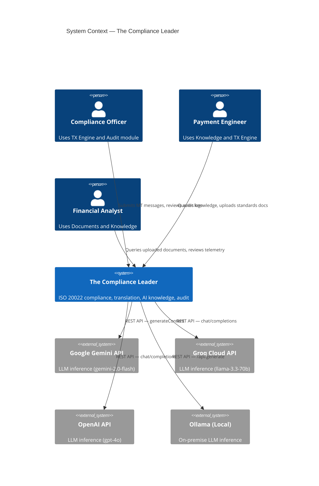

### 2.4 Module Architecture

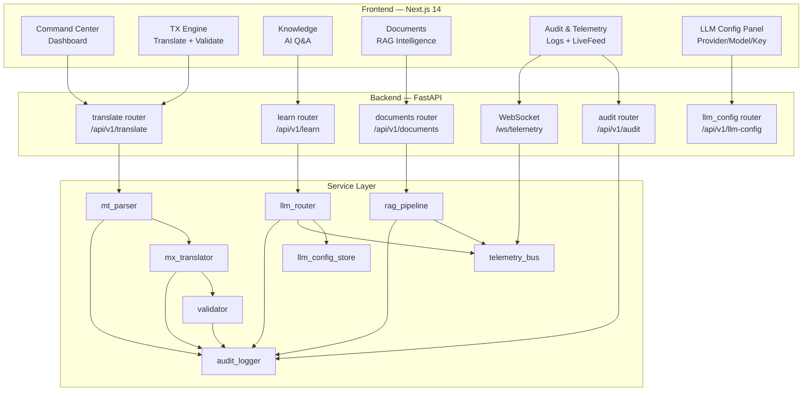

### 2.5 Technology Stack

#### Backend

| Layer | Technology | Version | Purpose |
|-------|-----------|---------|---------|
| Framework | FastAPI | 0.115.x | Async REST API + WebSocket |
| Runtime | Python | 3.13 | Application runtime |
| ASGI Server | Uvicorn | 0.34.x | Production ASGI server with hot-reload |
| Settings | Pydantic-Settings | 2.x | Type-safe configuration from .env |
| HTTP Client | httpx | 0.28.x | Async HTTP for LLM REST calls |
| File I/O | aiofiles | 24.x | Non-blocking file writes for audit log |
| Logging | structlog | 24.x | Structured JSON logging |
| Validation | Pydantic v2 | 2.x | Request/response schema validation |
| ML/Vector DB | ChromaDB | 0.6.x | Vector store (lazy-loaded) |
| Embeddings | sentence-transformers | — | Document chunk embeddings (lazy-loaded) |
| XML | lxml | 5.x | XSD validation of ISO 20022 XML |

#### Frontend

| Layer | Technology | Version | Purpose |
|-------|-----------|---------|---------|
| Framework | Next.js | 14.x | React SSR/CSR hybrid |
| Language | TypeScript | 5.x | Type safety |
| Styling | Vanilla CSS | — | Custom design system (no Tailwind) |
| Icons | Lucide-React | 0.4x | SVG icon library |
| Fonts | Inter + JetBrains Mono | — | Google Fonts |
| HTTP | fetch API | native | API calls from components |
| Real-time | WebSocket (native) | native | Telemetry stream |

### 2.6 Deployment Architecture

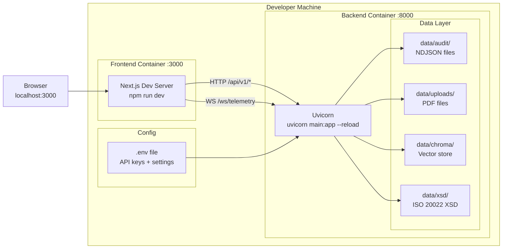

---

## 3. Low-Level Design (LLD)

### 3.1 Backend Service Decomposition

```
backend/
├── main.py                     ← FastAPI app factory, lifespan, CORS, health endpoint
├── config.py                   ← Pydantic-settings + built-in .env loader
├── models/
│   └── schemas.py              ← All Pydantic v2 request/response models
├── routers/
│   ├── translate.py            ← POST /translate, POST /validate, GET /sample/{type}
│   ├── learn.py                ← POST /learn, GET /learn/topics
│   ├── documents.py            ← POST /documents/upload, POST /documents/query, GET /documents
│   ├── audit.py                ← GET /audit/logs, GET /audit/export, WS /ws/telemetry
│   └── llm_config.py           ← GET/POST /llm-config, GET /llm-config/history, POST /test
└── services/
    ├── mt_parser.py            ← SWIFT MT block/field parser (regex-based, deterministic)
    ├── mx_translator.py        ← ISO 20022 XML generator (pacs.008/009/004)
    ├── validator.py            ← XSD + CBPR+ business rule validator
    ├── llm_router.py           ← Multi-provider LLM dispatcher (Gemini/Groq/OpenAI/Ollama)
    ├── llm_config_store.py     ← In-memory runtime LLM config with 25-entry history
    ├── rag_pipeline.py         ← PDF ingestion → chunking → embedding → ChromaDB
    ├── audit_logger.py         ← Append-only NDJSON, SHA-256 hash chain, PII masking
    └── telemetry_bus.py        ← WebSocket hub, broadcast to all connected clients
```

### 3.2 API Design

#### REST Endpoints

| Method | Path | Auth | Description |
|--------|------|------|-------------|
| `GET` | `/health` | None | System health check (all modules) |
| `POST` | `/api/v1/translate` | None | MT → MX translation |
| `POST` | `/api/v1/validate` | None | ISO 20022 XML validation |
| `GET` | `/api/v1/translate/sample/{type}` | None | Get sample MT messages |
| `POST` | `/api/v1/learn` | None | LLM domain Q&A |
| `GET` | `/api/v1/learn/topics` | None | List knowledge topics |
| `POST` | `/api/v1/documents/upload` | None | Upload PDF for RAG indexing |
| `POST` | `/api/v1/documents/query` | None | RAG-powered document Q&A |
| `GET` | `/api/v1/documents` | None | List uploaded documents |
| `GET` | `/api/v1/audit/logs` | None | Paginated audit log retrieval |
| `GET` | `/api/v1/audit/export` | None | Export full NDJSON audit bundle |
| `GET` | `/api/v1/llm-config` | None | Get current LLM configuration |
| `POST` | `/api/v1/llm-config` | None | Update LLM provider/model/key |
| `GET` | `/api/v1/llm-config/history` | None | Last 25 config changes |
| `GET` | `/api/v1/llm-config/models` | None | All providers + model catalogues |
| `POST` | `/api/v1/llm-config/test` | None | Test current LLM config |
| `WS` | `/ws/telemetry` | None | Real-time event stream |

#### OpenAPI Documentation
Available at: `http://localhost:8000/api/docs` (Swagger UI)  
ReDoc: `http://localhost:8000/api/redoc`

### 3.3 Data Models

#### Request Models

```python
# Translation Request
MTTranslateRequest:
    mt_raw: str           # Raw SWIFT MT string with block delimiters
    source_type: Literal["MT103", "MT103STP", "MT202", "MT202COV", "MT204",
                          "MT103RETURN", "MT202RETURN"]
    target_type: Optional[str]  # Override auto-detected ISO 20022 target

# Learn (LLM Q&A) Request
LearnRequest:
    query: str            # Financial domain question (min 3 chars)
    context: Optional[str]  # Optional XML snippet to anchor response

# Document Query Request
DocumentQueryRequest:
    query: str            # Natural-language question
    top_k: int            # Number of chunks to retrieve (1–20, default 5)

# LLM Config Update Request
LLMConfigUpdateRequest:
    provider: Optional[str]         # gemini | groq | openai | ollama
    model: Optional[str]            # Model ID
    api_key: Optional[str]          # API key (masked in responses)
    ollama_base_url: Optional[str]  # Ollama server URL
```

#### Response Models

```python
# Translation Response
TranslationResponse:
    status: str                  # SUCCESS | PARTIAL | ERROR
    message_type: str            # e.g. pacs.008.001.08
    xml_output: Optional[str]    # Generated ISO 20022 XML
    uetr: Optional[str]          # Unique End-to-end Transaction Reference
    validation_errors: List[str] # CBPR+ / XSD errors (empty if clean)
    audit_id: str                # Audit log entry ID
    timestamp: str               # ISO 8601

# Audit Log Entry
AuditLogEntry:
    audit_id: str        # UUID4
    timestamp: str       # ISO 8601
    event_type: str      # TRANSLATION | VALIDATION | LEARN_QUERY | DOCUMENT_UPLOAD
    module: str          # translate | learn | documents | audit
    status: str          # SUCCESS | ERROR | PARTIAL
    uetr: Optional[str]  # Payment UETR if applicable
    message_type: Optional[str]
    details: Dict        # PII-masked event details
    hash: str            # SHA-256 hash (chained)
```

### 3.4 Translation Engine — Deterministic Processing Pipeline

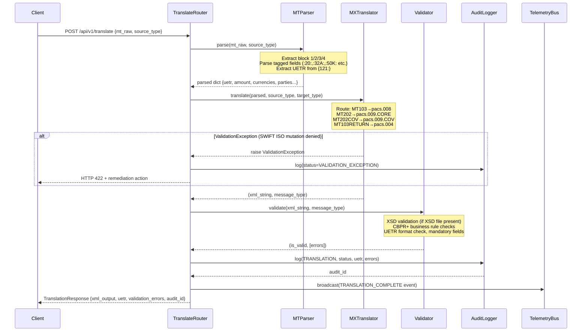

#### MT → MX Mapping Table

| Source MT | Target MX | Description |
|-----------|-----------|-------------|
| MT103 | pacs.008.001.08 | Customer Credit Transfer |
| MT103STP | pacs.008.001.08 | Straight-Through Processing variant |
| MT202 | pacs.009.001.08 (CORE) | FI Credit Transfer — no retail fields |
| MT202COV | pacs.009.001.08 (COV) | Includes `<UndrlygCstmrCdtTrf>` block |
| MT204 | pacs.009.001.08 (ADV) | Direct Debit Advice |
| MT103RETURN | pacs.004.001.09 | Payment Return |
| MT202RETURN | pacs.004.001.09 | Payment Return (FI) |

#### CBPR+ Validation Rules Implemented

```
RULE-001: pacs.009 CORE must NOT contain InstructedAmt or retail debtor/creditor fields
RULE-002: pacs.009 COV MUST contain UndrlygCstmrCdtTrf block
RULE-003: UETR must be valid UUID4 format
RULE-004: IntrBkSttlmAmt must have valid ISO 4217 currency code
RULE-005: BIC codes must be 8 or 11 characters
RULE-006: pacs.004 must reference OrgnlUETR and OrgnlMsgId
RULE-007: Return reason code must be from external code set
```

### 3.5 Audit Logger — Hash-Chain Design

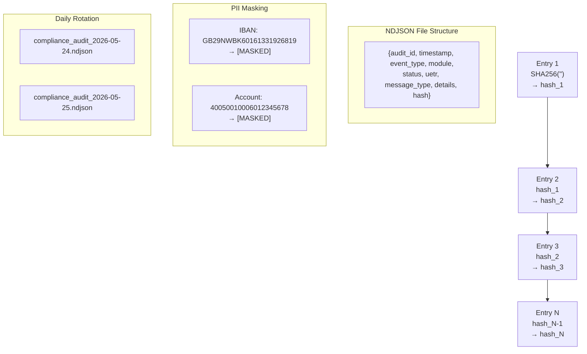

**Hash-Chain Algorithm:**
```
genesis_hash = SHA256("")
entry.hash   = SHA256(SHA256(prev_hash) + SHA256(json_string(entry_without_hash)))
```

This means tampering with **any** historical entry invalidates **all subsequent** entries — providing cryptographic tamper evidence.

### 3.6 LLM Router — Multi-Provider Architecture

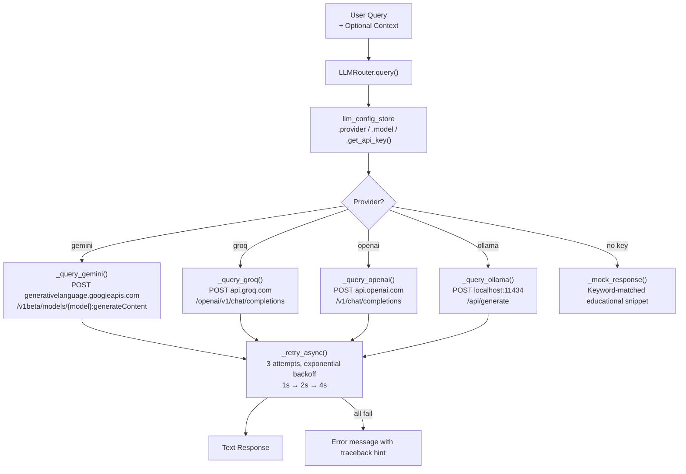

**Financial System Prompt (injected for all providers):**
```
"You are an expert financial systems educator specializing in ISO 20022,
SWIFT messaging, global clearing and settlement, and cross-border payment law.
You provide precise, structured, zero-fluff explanations..."
```

### 3.7 RAG Pipeline — Document Intelligence

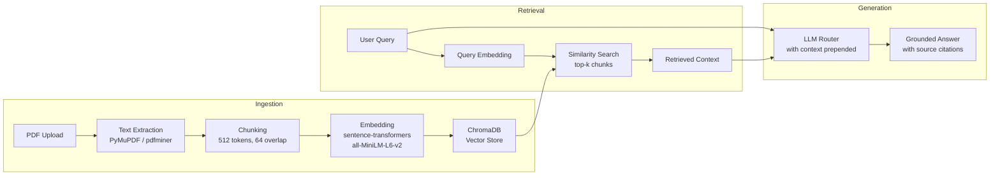

### 3.8 Telemetry Bus — WebSocket Architecture

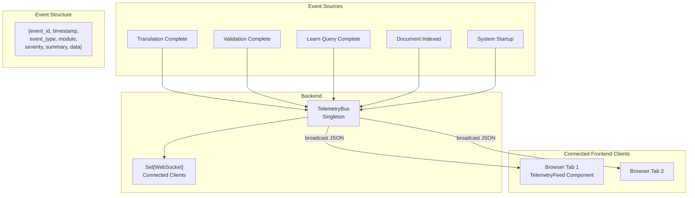

**WebSocket lifecycle:**
1. Client connects → `telemetry_bus.connect(ws)` → adds to `_clients` set
2. Server sends `CONNECTED` event with client info
3. On each platform event → `await telemetry_bus.broadcast(event_dict)`
4. Dead clients (disconnected) silently pruned during next broadcast
5. `WebSocketDisconnect` → `telemetry_bus.disconnect(ws)`

### 3.9 LLM Config Store — Runtime Hot-Swap

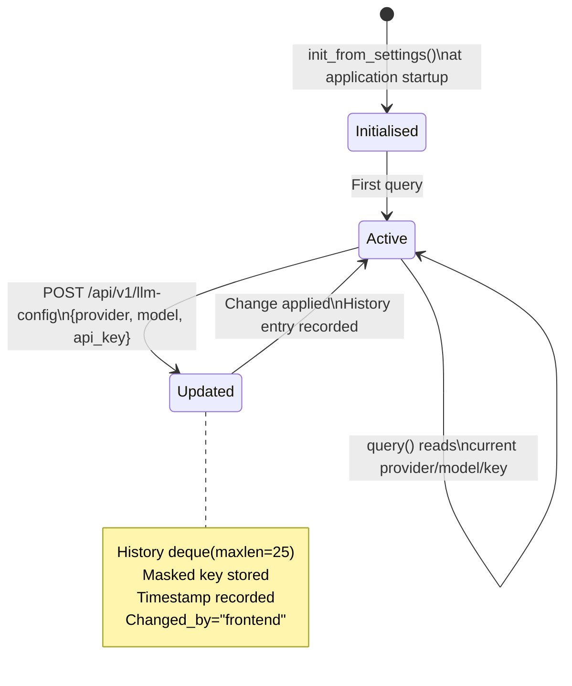

---

## 4. Sequence Diagrams

### 4.1 End-to-End MT103 Translation Flow

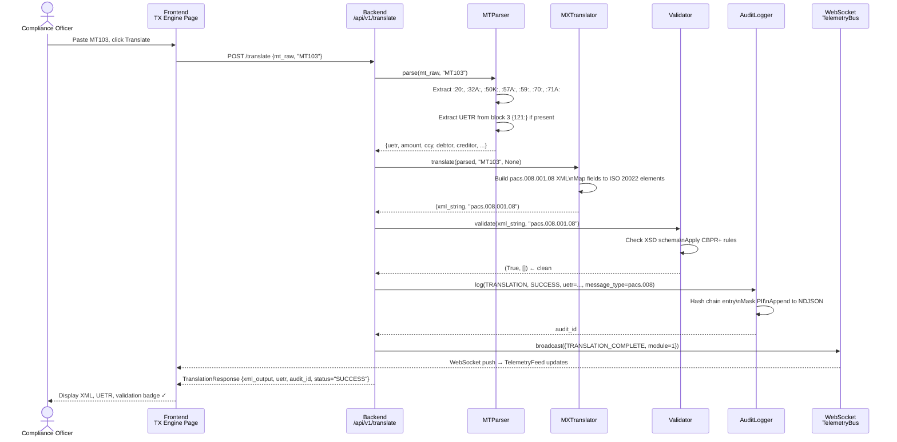

### 4.2 Knowledge Q&A (LLM) Flow

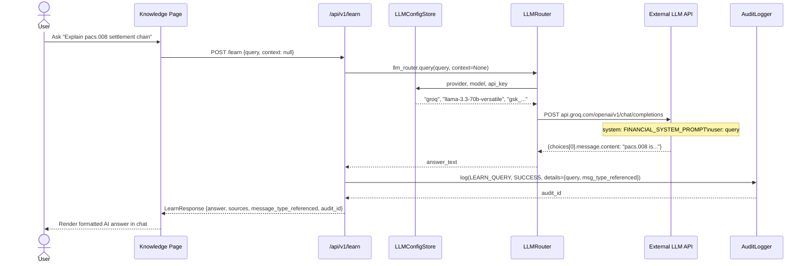

---

## 5. Data Flow Diagrams

### 5.1 Complete Platform Data Flow

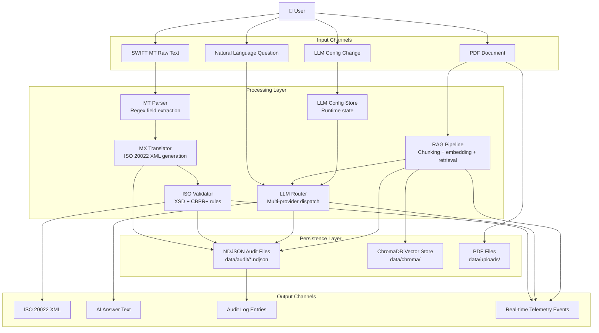

---

## 6. Non-Functional Requirements

| NFR | Requirement | Implementation |
|-----|------------|----------------|
| **Performance** | Translation < 200ms P95 | Fully async, no blocking I/O |
| **LLM Response** | < 10s P90 | 3-attempt retry with 60s timeout per call |
| **Availability** | 99.5% during business hours | Graceful fallback mock on LLM failure |
| **Security** | No PII in logs | Regex IBAN/account masking before write |
| **Auditability** | Tamper-evident trail | SHA-256 hash chain on every entry |
| **Scalability** | Stateless API | All state in files/ChromaDB, not RAM |
| **Observability** | Structured logging | structlog JSON to stdout |
| **Portability** | Cross-platform | Python pathlib, no hardcoded paths |

---

## 7. Security Architecture

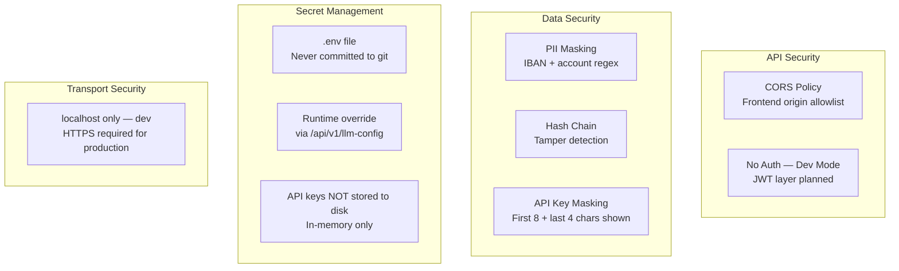

### Key Security Controls

| Control | Description |
|---------|------------|
| **IBAN Masking** | Regex `[A-Z]{2}[0-9]{2}[A-Z0-9]{4,}` → `[MASKED]` before any write |
| **Account Masking** | 8+ digit numeric strings → `[MASKED]` |
| **Key Masking** | API keys shown as `AIzaSyAh****gmhg` (preview only) |
| **Hash Chain** | Each audit entry linked to previous — tampering detectable |
| **CORS** | Only `http://localhost:3000` and `http://127.0.0.1:3000` allowed |
| **Error Sanitisation** | Global exception handler returns generic errors (no stack traces) |
| **Key in Memory Only** | API keys held in `llm_config_store._api_keys` dict — never written to disk from frontend override |

---

*Document maintained by the Engineering team. Update with each architecture change.*
