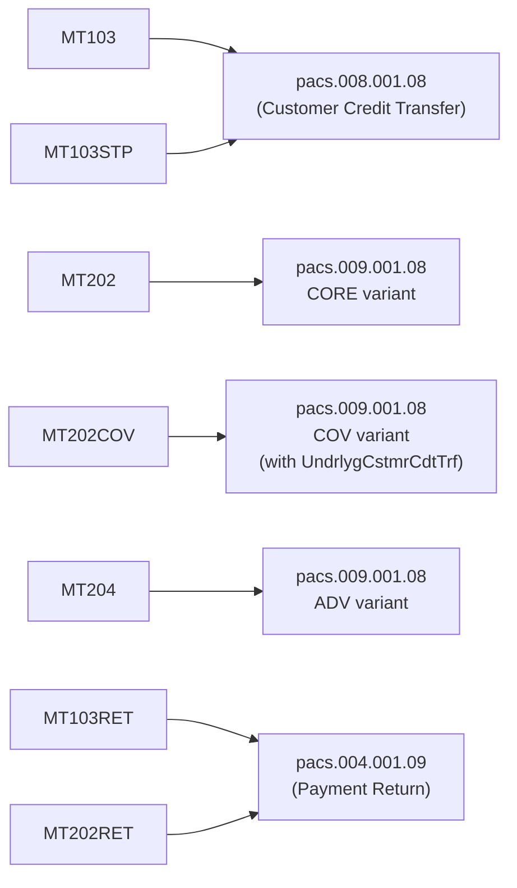
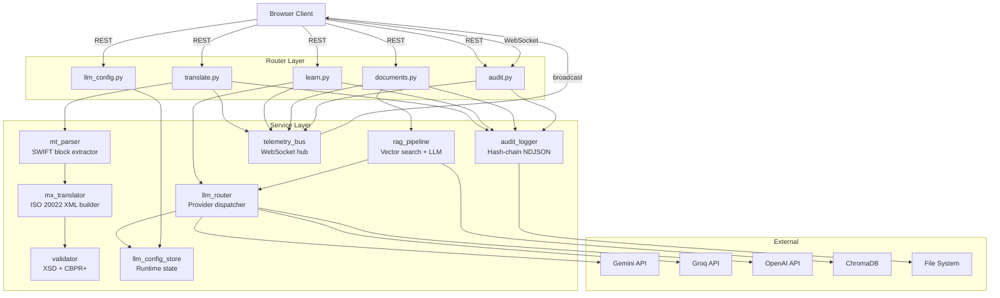
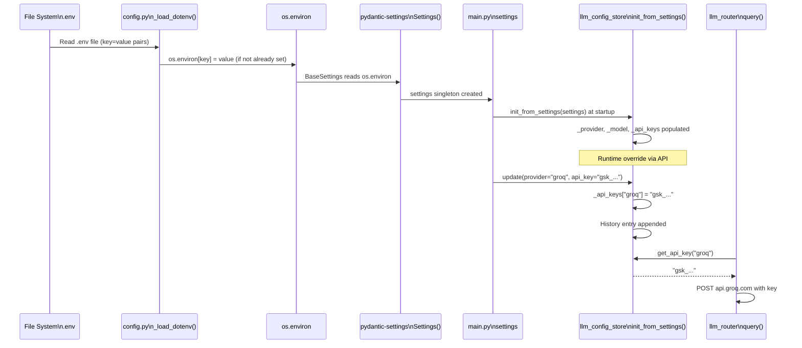

# The Compliance Leader — File & Folder Hierarchy + Data Flow

> **Document Type:** Codebase Navigation & Architecture Reference  
> **Version:** 1.0.0  
> **Date:** May 2026

---

## Table of Contents

1. [Complete File Tree](#1-complete-file-tree)
2. [Project Root Files](#2-project-root-files)
3. [Backend — Detailed Explanation](#3-backend--detailed-explanation)
4. [Frontend — Detailed Explanation](#4-frontend--detailed-explanation)
5. [Data Directory](#5-data-directory)
6. [Inter-Module Data Flow](#6-inter-module-data-flow)
7. [Import Dependency Graph](#7-import-dependency-graph)
8. [Configuration Flow](#8-configuration-flow)
9. [File Lifecycle & Creation Times](#9-file-lifecycle--creation-times)

---

## 1. Complete File Tree

```
WirePaymentAssistance/                          ← Project root
│
├── .env                                        ← Secret keys & runtime config (NEVER commit)
├── .env.example                                ← Template showing all required env vars
├── README.md                                   ← Quick-start guide
├── docker-compose.yml                          ← Optional Docker orchestration
│
├── backend/                                    ← FastAPI Python application
│   ├── main.py                                 ← App factory, lifespan, health, CORS
│   ├── config.py                               ← Pydantic-settings + built-in .env loader
│   ├── requirements.txt                        ← Full dependency list
│   ├── requirements-core.txt                   ← Pure-Python wheels (no C compilation)
│   ├── requirements-ml.txt                     ← Heavy ML packages (prefer-binary flag)
│   │
│   ├── models/
│   │   ├── __init__.py
│   │   └── schemas.py                          ← All Pydantic v2 request/response models
│   │
│   ├── routers/
│   │   ├── __init__.py
│   │   ├── translate.py                        ← POST /translate, POST /validate, GET /sample
│   │   ├── learn.py                            ← POST /learn, GET /learn/topics
│   │   ├── documents.py                        ← POST /upload, POST /query, GET /documents
│   │   ├── audit.py                            ← GET /logs, GET /export, WS /ws/telemetry
│   │   └── llm_config.py                       ← GET/POST /llm-config, history, models, test
│   │
│   └── services/
│       ├── __init__.py
│       ├── mt_parser.py                        ← SWIFT MT block/field parser (deterministic)
│       ├── mx_translator.py                    ← ISO 20022 XML generator (pacs.008/009/004)
│       ├── validator.py                        ← XSD + CBPR+ business rule validator
│       ├── llm_router.py                       ← Multi-provider LLM dispatcher
│       ├── llm_config_store.py                 ← Runtime LLM config (in-memory, hot-swap)
│       ├── rag_pipeline.py                     ← PDF → chunks → embeddings → ChromaDB
│       ├── audit_logger.py                     ← Append-only NDJSON, SHA-256 hash chain
│       └── telemetry_bus.py                    ← WebSocket pub-sub hub
│
├── frontend/                                   ← Next.js 14 TypeScript application
│   ├── package.json                            ← npm dependencies & scripts
│   ├── next.config.ts                          ← Next.js configuration
│   ├── tsconfig.json                           ← TypeScript compiler options
│   │
│   ├── app/                                    ← Next.js App Router pages
│   │   ├── layout.tsx                          ← Root layout (Sidebar + TopBar wrapper)
│   │   ├── globals.css                         ← Complete design system (1600+ lines)
│   │   ├── page.tsx                            ← Command Center (Dashboard)
│   │   ├── translate/
│   │   │   └── page.tsx                        ← TX Engine page
│   │   ├── learn/
│   │   │   └── page.tsx                        ← Knowledge / LLM Q&A page
│   │   ├── documents/
│   │   │   └── page.tsx                        ← Document Intelligence page
│   │   └── audit/
│   │       └── page.tsx                        ← Audit & Telemetry page
│   │
│   └── components/                             ← Reusable React components
│       ├── Sidebar.tsx                         ← Navigation + health + uptime + LLM config btn
│       ├── TopBar.tsx                          ← Breadcrumb + clock
│       ├── TelemetryFeed.tsx                   ← Real-time WebSocket event stream display
│       ├── AuditTable.tsx                      ← Paginated audit log table
│       ├── DocumentUploader.tsx                ← Drag-and-drop PDF upload + query UI
│       ├── ValidationBadge.tsx                 ← ISO 20022 validation status indicator
│       └── LLMConfigPanel.tsx                  ← Provider/model/key switcher (React Portal modal)
│
├── data/                                       ← Runtime-generated data (gitignored)
│   ├── audit/                                  ← NDJSON audit log files (daily rotation)
│   │   └── compliance_audit_YYYY-MM-DD.ndjson
│   ├── uploads/                                ← Uploaded PDF documents
│   ├── chroma/                                 ← ChromaDB vector store (persistent)
│   └── xsd/                                    ← ISO 20022 XSD schema files
│
└── documentation/                              ← Project documentation (this folder)
    ├── 01_HLD_LLD.md
    ├── 02_file_hierarchy.md
    ├── 03_user_manual.md
    ├── 04_interview_questions.md
    └── 05_presentation.html
```

---

## 2. Project Root Files

### `.env` — Environment Configuration

```bash
# LLM Provider (gemini | groq | openai | ollama)
LLM_PROVIDER=gemini
GEMINI_API_KEY=AIzaSy...
GEMINI_MODEL=gemini-2.0-flash

# Optional providers
GROQ_API_KEY=gsk_...
OPENAI_API_KEY=sk-...
OLLAMA_BASE_URL=http://localhost:11434

# Server
FRONTEND_ORIGIN=http://localhost:3000
PORT=8000
```

**Who reads it:** `backend/config.py` — loaded by `_load_dotenv()` (built-in parser) before pydantic-settings reads `os.environ`.  
**Security:** Never committed. `.gitignore` must include `.env`.

### `docker-compose.yml`

Defines two services: `backend` (Python/uvicorn, port 8000) and `frontend` (Node.js/Next.js, port 3000) with volume mounts for `data/`. Optional — the platform runs fine without Docker.

---

## 3. Backend — Detailed Explanation

### `main.py` — Application Factory

**Role:** Creates and configures the FastAPI application.  
**Key responsibilities:**
- `_load_dotenv()` called via `config.py` import (happens first)
- `create_app()` factory function registers all routers, middleware, and event handlers
- `lifespan` async context manager: startup (init config store, create directories, seed audit) → yield → shutdown
- `GET /health` endpoint returning per-module health status
- Global exception handler (prevents stack trace leakage to clients)
- CORS middleware configured for `http://localhost:3000`

```mermaid
flowchart TD
    START[Python starts] --> CONFIG[config.py imported\n_load_dotenv runs\nsettings created]
    CONFIG --> FACTORY[create_app()]
    FACTORY --> CORS[CORS middleware added]
    CORS --> ROUTERS[5 routers registered\n+ WebSocket router]
    ROUTERS --> LIFESPAN[lifespan context]
    LIFESPAN --> INIT[llm_config_store.init_from_settings\nDirectories created\nAudit seed event]
    INIT --> READY[App ready\nListening :8000]
```

---

### `config.py` — Settings Management

**Role:** Single source of truth for all configuration.  
**Pattern:** Pydantic-Settings `BaseSettings` — reads from `os.environ` (which is pre-populated by `_load_dotenv`).

```python
# Key settings and their defaults
LLM_PROVIDER:    str  = "gemini"
GEMINI_API_KEY:  Optional[str] = None   ← None means mock mode
GEMINI_MODEL:    str  = "gemini-2.0-flash"
FRONTEND_ORIGIN: str  = "http://localhost:3000"
BASE_DATA_DIR:   str  = project_root / "data"

# Computed properties (not env vars)
AUDIT_DIR    → BASE_DATA_DIR / "audit"
UPLOAD_DIR   → BASE_DATA_DIR / "uploads"
XSD_DIR      → BASE_DATA_DIR / "xsd"
CHROMA_DIR   → BASE_DATA_DIR / "chroma"
```

**Why built-in dotenv loader?** Pydantic-settings had Windows path resolution issues with `env_file`. The custom `_load_dotenv()` pre-loads all key=value pairs into `os.environ` ensuring guaranteed loading regardless of OS.

---

### `models/schemas.py` — Data Contracts

**Role:** Defines all API request and response shapes using Pydantic v2.  
**Models defined:**

| Schema | Direction | Used By |
|--------|-----------|---------|
| `MTTranslateRequest` | Request | `POST /translate` |
| `MXValidateRequest` | Request | `POST /validate` |
| `TranslationResponse` | Response | `POST /translate` |
| `ValidationExceptionResponse` | Response (422) | `POST /translate` |
| `LearnRequest` | Request | `POST /learn` |
| `LearnResponse` | Response | `POST /learn` |
| `DocumentUploadResponse` | Response | `POST /documents/upload` |
| `DocumentQueryRequest` | Request | `POST /documents/query` |
| `DocumentQueryResponse` | Response | `POST /documents/query` |
| `AuditLogEntry` | Response | `GET /audit/logs` |
| `AuditLogsResponse` | Response | `GET /audit/logs` |
| `TelemetryEvent` | WebSocket | `WS /ws/telemetry` |
| `HealthResponse` | Response | `GET /health` |

---

### `routers/translate.py` — Translation & Validation Router

**Endpoints:**
- `POST /api/v1/translate` → orchestrates MT→MX pipeline
- `POST /api/v1/validate` → standalone XML validation
- `GET /api/v1/translate/sample/{message_type}` → returns sample MT strings

**Data flow:**
```
Request → MTParser → MXTranslator → Validator → AuditLogger → TelemetryBus → Response
```

**Sample messages available:** MT103, MT103STP, MT202, MT202COV, MT204, MT103RETURN, MT202RETURN

---

### `routers/learn.py` — Knowledge Router

**Endpoints:**
- `POST /api/v1/learn` → passes query to `llm_router.query()`, logs to audit, broadcasts telemetry
- `GET /api/v1/learn/topics` → returns 12 hardcoded financial domain topic cards

**Topic catalogue includes:**
- pacs.008, pacs.009 (CORE/COV/ADV), pacs.004
- MT103/MT202 field breakdowns
- CBPR+ guidelines, ISO 20022 settlement chain
- UETR tracking, Nostro/Vostro, TARGET2/FedNow/CHAPS

---

### `routers/documents.py` — Document Intelligence Router

**Endpoints:**
- `POST /api/v1/documents/upload` (multipart/form-data) → PDF → RAG pipeline → indexed
- `POST /api/v1/documents/query` → RAG search + LLM answer generation
- `GET /api/v1/documents` → list all indexed documents

**File storage:** Uploaded PDFs saved to `data/uploads/{doc_id}_{filename}`

---

### `routers/audit.py` — Audit & Telemetry Router

**Endpoints:**
- `GET /api/v1/audit/logs?page=1&page_size=50&event_type=&module=&from_date=&to_date=` → paginated log
- `GET /api/v1/audit/export` → streams full NDJSON bundle as file download
- `WS /ws/telemetry` → WebSocket connection management

---

### `routers/llm_config.py` — LLM Configuration Router

**Endpoints:**
- `GET /api/v1/llm-config` → current active config (masked key)
- `POST /api/v1/llm-config` → update provider/model/key (immediate effect)
- `GET /api/v1/llm-config/history` → last 25 changes (most recent first)
- `GET /api/v1/llm-config/models` → full model catalogue per provider
- `POST /api/v1/llm-config/test` → lightweight ping to verify current config

---

### `services/mt_parser.py` — SWIFT MT Parser

**Role:** Parses raw SWIFT MT message strings into structured Python dicts.  
**Algorithm:**
1. Extract blocks using regex: `{1:...}{2:...}{3:...}{4:\n...-}`
2. Parse Block 3 for UETR `{121:uuid4}`
3. Extract tagged fields from Block 4: `:20:`, `:32A:`, `:50K:`, `:52A:`, `:57A:`, `:59:`, etc.
4. Parse `:32A:` → date (YYMMDD→ISO), currency, amount
5. Detect message type (MT103, MT202, MT202COV) from Block 2 message type code

**Key exports:**
- `mt_parser.parse(raw_str, source_type) → dict`
- `SAMPLE_MT103`, `SAMPLE_MT202`, `SAMPLE_MT202COV`, `SAMPLE_MT103RETURN`, `SAMPLE_MT202RETURN`

---

### `services/mx_translator.py` — ISO 20022 XML Generator

**Role:** Converts parsed MT dict into ISO 20022 compliant XML string.  
**Size:** ~23KB — the largest and most complex service.

**Translation routes:**



**CBPR+ guard:** `ValidationException` raised if a mutation would violate ISO schema rules (e.g., including retail fields in MT202 CORE → pacs.009 CORE).

---

### `services/validator.py` — ISO 20022 Validator

**Role:** Post-translation validation layer.  
**Two-stage validation:**
1. **XSD Validation** — checks XML structure against ISO 20022 schema file (if present in `data/xsd/`)
2. **CBPR+ Business Rules** — programmatic checks:
   - UETR must be UUID4
   - Currency codes must be ISO 4217
   - BIC must be 8 or 11 chars
   - Mandatory elements present
   - Prohibited field combinations

**Returns:** `(is_valid: bool, errors: List[str])`

---

### `services/llm_router.py` — LLM Dispatcher

**Role:** Routes LLM queries to the runtime-configured provider.  
**Reads from:** `llm_config_store` (not static settings).

**Provider calls (all via httpx REST):**

| Provider | Endpoint | Auth |
|----------|---------|------|
| Gemini | `generativelanguage.googleapis.com/v1beta/models/{model}:generateContent` | `?key=API_KEY` |
| Groq | `api.groq.com/openai/v1/chat/completions` | `Authorization: Bearer gsk_...` |
| OpenAI | `api.openai.com/v1/chat/completions` | `Authorization: Bearer sk-...` |
| Ollama | `{base_url}/api/generate` | No auth |

**Retry:** 3 attempts with exponential backoff (1s → 2s → 4s) before failing.

---

### `services/llm_config_store.py` — Runtime Config Store

**Role:** In-memory singleton holding the currently active LLM configuration.  
**Lifecycle:**
1. `init_from_settings(settings)` called at startup → loads from `.env`
2. `update(provider, model, api_key)` called from `POST /llm-config` → immediate effect
3. `get_api_key(provider)` called by `llm_router` before every LLM call
4. History stored as `deque(maxlen=25)` → auto-drops oldest entry

**Model catalogue (built-in):**

```
gemini: 5 models  (gemini-2.0-flash, 2.0-flash-lite, 1.5-flash, 1.5-pro, 1.0-pro)
groq:   6 models  (llama-3.3-70b, llama-3.1-8b, llama3-70b, llama3-8b, mixtral-8x7b, gemma2-9b)
openai: 4 models  (gpt-4o, gpt-4o-mini, gpt-4-turbo, gpt-3.5-turbo)
ollama: 6 models  (llama3, llama3.1, llama3:70b, mistral, codellama, custom)
```

---

### `services/rag_pipeline.py` — Document Intelligence Pipeline

**Role:** PDF ingestion, chunking, embedding, storage, and retrieval.  
**Lazy loading:** ChromaDB and sentence-transformers imported only on first document operation.

**Ingestion flow:**
```
PDF bytes → text extraction (pdfminer/PyMuPDF)
         → chunks (512 tokens, 64 overlap)
         → embeddings (all-MiniLM-L6-v2, 384-dim)
         → ChromaDB upsert (doc_id, chunk_index metadata)
```

**Retrieval flow:**
```
query string → embedding → ChromaDB similarity search (top-k)
            → retrieved chunks → prepended to LLM context
            → LLM generates grounded answer
```

---

### `services/audit_logger.py` — Tamper-Evident Audit Log

**Role:** Append-only, hash-chained, PII-masked structured audit log.

**File format:** NDJSON (Newline-Delimited JSON) — one JSON object per line.

**Hash algorithm:**
```python
sha256(sha256(prev_hash_bytes) + sha256(entry_json_bytes)).hexdigest()
```

**PII masking patterns:**
- IBAN: `[A-Z]{2}[0-9]{2}[A-Z0-9]{4,}` → `[MASKED]`
- Account numbers: `\d{8,}` → `[MASKED]`

**Async safety:** All writes protected by `asyncio.Lock()` — concurrent requests serialized safely.

---

### `services/telemetry_bus.py` — WebSocket Event Hub

**Role:** Broadcasts real-time events to all connected WebSocket clients.

**State:** `_clients: Set[WebSocket]` — all active connections.

**Dead client detection:** During each broadcast, clients that have disconnected are silently removed from the set.

**Event schema:**
```json
{
  "event_id": "uuid4",
  "timestamp": "ISO8601",
  "event_type": "TRANSLATION_COMPLETE",
  "module": 1,
  "severity": "INFO",
  "summary": "MT103 → pacs.008 translation succeeded",
  "data": {"audit_id": "...", "uetr": "...", "validation_errors": 0}
}
```

---

## 4. Frontend — Detailed Explanation

### `app/layout.tsx` — Root Layout

**Role:** Wraps every page with Sidebar and TopBar.  
**Renders:** `<html>` → `<body>` → background orbs → `<div.app-layout>` → `<Sidebar>` + `<div.main-content>` → `<TopBar>` + `{children}`

**Critical:** Sets `html` and `body` to `width: 100%; height: 100%` for full-viewport layout.

---

### `app/globals.css` — Design System (~44KB)

**Role:** Complete CSS design system. No Tailwind, no CSS-in-JS.

**Sections:**
```
1.  Google Fonts import (Inter + JetBrains Mono)
2.  CSS Custom Properties / Design Tokens (colors, spacing, radii, shadows)
3.  CSS Reset & Base Styles
4.  Custom Scrollbar
5.  Keyframe Animations (fadeIn, slideInUp, pulse-glow, shimmer, spin...)
6.  Animation Utility Classes
7.  Glass Panel Components
8.  Button Components (primary, secondary, danger, success, ghost, sm, lg)
9.  Status Badge Components
10. Gradient Text
11. Input & Form Elements
12. Card Component
13. Module Header
14. Sidebar Styles
15. Topbar Styles
16. Main Layout (app-layout, main-content, page-container)
17. Table Styles
18+ Page-specific styles (translate, learn, audit, documents, dashboard)
```

**Key design tokens:**
```css
--color-bg:       #080C14  /* Deep navy background */
--color-primary:  #00D4FF  /* Cyan accent */
--color-success:  #00E5A0  /* Green */
--color-warning:  #FFB800  /* Amber */
--sidebar-width:  240px
--topbar-height:  64px
```

---

### Page Files

| File | Route | Key Features |
|------|-------|-------------|
| `app/page.tsx` | `/` | Stat cards (count-up animation), recent audits, telemetry feed |
| `app/translate/page.tsx` | `/translate` | MT type selector, raw input, XML viewer, validation badges |
| `app/learn/page.tsx` | `/learn` | Chat UI, topic sidebar, 12 learning cards |
| `app/documents/page.tsx` | `/documents` | Drag-drop upload, document list, RAG query interface |
| `app/audit/page.tsx` | `/audit` | Paginated log table, filters, export button, live WS feed |

---

### Component Files

#### `Sidebar.tsx`
- Fixed left navigation (240px wide)
- 5 nav items with active state highlighting
- Health check polling every 30s (`GET /health`)
- Uptime counter (increments every second)
- **LLMConfigPanel** embedded in System section

#### `TopBar.tsx`
- Fixed top bar (64px height)
- Breadcrumb navigation (reads current route)
- Digital clock (updates every second)

#### `TelemetryFeed.tsx`
- Connects to `ws://localhost:8000/ws/telemetry`
- Displays last 50 events as a live scrolling list
- Color-coded by severity (INFO=cyan, WARN=amber, ERROR=red)
- Auto-reconnects on disconnect

#### `AuditTable.tsx`
- Paginated table of audit log entries
- Client-side sorting, filtering
- UETR copy-to-clipboard
- Hash preview with truncation

#### `DocumentUploader.tsx`
- Drag-and-drop PDF upload
- Upload progress indicator
- Indexed document list
- Inline RAG query interface

#### `ValidationBadge.tsx`
- Displays ISO 20022 validation status
- Green checkmark (VALID) / amber warning (PARTIAL) / red X (INVALID)
- Lists specific CBPR+ errors

#### `LLMConfigPanel.tsx` ⭐ New
- **React Portal** — renders at `document.body` level (not inside sidebar DOM)
- Prevents modal clipping/positioning issues
- Provider grid: Gemini / Groq / OpenAI / Ollama
- Model dropdown (populated from backend)
- API key input (show/hide toggle)
- Test Connection → `POST /api/v1/llm-config/test`
- Apply → `POST /api/v1/llm-config`
- History tab showing last 25 changes

---

## 5. Data Directory

```
data/
├── audit/
│   └── compliance_audit_2026-05-24.ndjson    ← Today's audit log
│       compliance_audit_2026-05-23.ndjson    ← Yesterday's log
│       ...
│
├── uploads/
│   └── abc123_swift_guidelines.pdf
│       def456_iso20022_spec.pdf
│
├── chroma/
│   └── [ChromaDB internal files]             ← Vector embeddings (binary)
│
└── xsd/
    └── pacs.008.001.08.xsd                   ← Optional XSD files for strict validation
        pacs.009.001.08.xsd
        pacs.004.001.09.xsd
```

**Audit file sample:**
```json
{"audit_id":"a1b2c3","timestamp":"2026-05-24T04:06:07Z","event_type":"TRANSLATION","module":"translate","status":"SUCCESS","uetr":"550e8400-e29b-41d4-a716-446655440000","message_type":"pacs.008.001.08","details":{"source_type":"MT103","target_type":"pacs.008.001.08","validation_errors":[]},"hash":"3a7bd3e2..."}
```

---

## 6. Inter-Module Data Flow



---

## 7. Import Dependency Graph

```mermaid
graph TD
    subgraph "main.py imports"
        MAIN[main.py]
        MAIN --> CONFIG[config.py]
        MAIN --> SCHEMAS[models/schemas.py]
        MAIN --> R_TR[routers/translate.py]
        MAIN --> R_LR[routers/learn.py]
        MAIN --> R_DR[routers/documents.py]
        MAIN --> R_AR[routers/audit.py]
        MAIN --> R_CFG[routers/llm_config.py]
        MAIN --> S_AUD[services/audit_logger.py]
        MAIN --> S_LCS[services/llm_config_store.py]
        MAIN --> S_RAG[services/rag_pipeline.py]
        MAIN --> S_TEL[services/telemetry_bus.py]
    end

    subgraph "Router imports"
        R_TR --> S_MT[services/mt_parser.py]
        R_TR --> S_MX[services/mx_translator.py]
        R_TR --> S_VAL[services/validator.py]
        R_TR --> S_AUD
        R_TR --> S_TEL

        R_LR --> S_LLM[services/llm_router.py]
        R_LR --> S_AUD & S_TEL

        R_DR --> S_RAG & S_AUD & S_TEL
        R_AR --> S_AUD & S_TEL
        R_CFG --> S_LCS
    end

    subgraph "Service imports"
        S_LLM --> S_LCS
        S_RAG --> S_LLM
        S_MX --> SCHEMAS
        S_AUD --> CONFIG
        S_LLM --> CONFIG2[config.py\n(startup only)]
    end
```

---

## 8. Configuration Flow



---

## 9. File Lifecycle & Creation Times

| File | Created | Modified By | Notes |
|------|---------|------------|-------|
| `.env` | Project init | Developer | Never auto-modified |
| `config.py` | Project init | Developer | Settings source |
| `main.py` | Project init | Developer | App factory |
| `services/llm_config_store.py` | Session 3 | AI | Runtime hot-swap config |
| `routers/llm_config.py` | Session 3 | AI | 5 new API endpoints |
| `services/llm_router.py` | Session 2, refactored S3 | AI | Added Groq, uses config store |
| `components/LLMConfigPanel.tsx` | Session 3 | AI | React Portal modal |
| `data/audit/*.ndjson` | Runtime | audit_logger | Auto-created daily |
| `data/chroma/` | Runtime | rag_pipeline | Auto-created on first upload |
| `documentation/` | Session 4 | AI | This folder |

---

*This document is auto-maintained. Update the file tree section when adding new files.*
